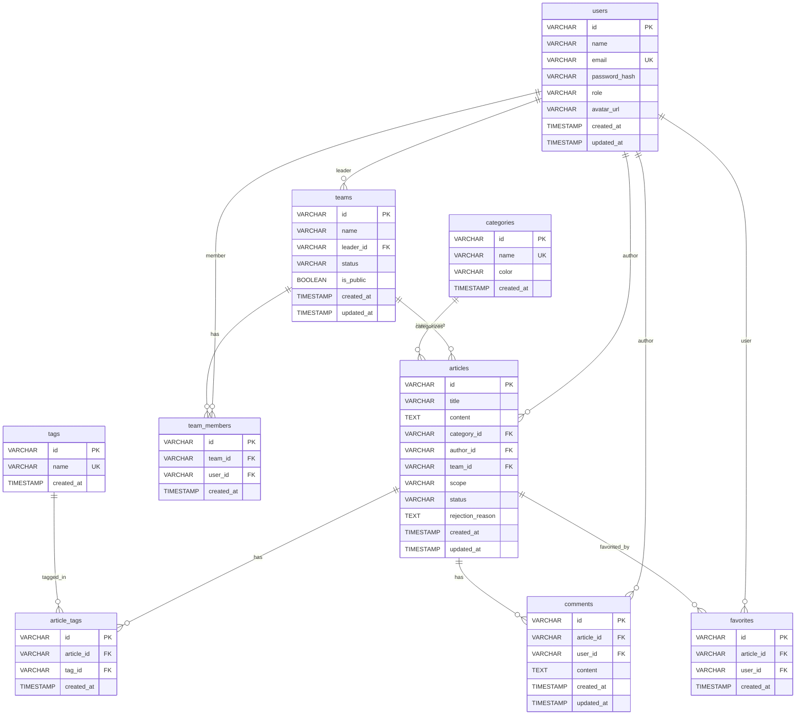

# ER図

## 概要

ナレッジ共有アプリケーションのエンティティリレーションシップ図（ER図）です。

## ER図（Mermaid形式）

## リレーション説明

### 1対多（1:N）のリレーション

1. **users → teams** (1:N)
   - 1人のユーザーが複数のチームのリーダーになれる
   - `teams.leader_id` が外部キー

2. **users → articles** (1:N)
   - 1人のユーザーが複数の記事を投稿できる
   - `articles.author_id` が外部キー

3. **users → comments** (1:N)
   - 1人のユーザーが複数のコメントを投稿できる
   - `comments.user_id` が外部キー

4. **teams → articles** (1:N)
   - 1つのチームに複数の記事が紐づく（チーム限定記事）
   - `articles.team_id` が外部キー（NULL許可）

5. **categories → articles** (1:N)
   - 1つのカテゴリに複数の記事が紐づく
   - `articles.category_id` が外部キー

6. **articles → comments** (1:N)
   - 1つの記事に複数のコメントが付けられる
   - `comments.article_id` が外部キー

### 多対多（N:M）のリレーション

1. **users ↔ teams** (N:M)
   - 中間テーブル: `team_members`
   - 1人のユーザーが複数のチームに所属できる
   - 1つのチームに複数のメンバーが所属できる

2. **articles ↔ tags** (N:M)
   - 中間テーブル: `article_tags`
   - 1つの記事に複数のタグが付けられる
   - 1つのタグが複数の記事で使用される

3. **articles ↔ users（お気に入り）** (N:M)
   - 中間テーブル: `favorites`
   - 1人のユーザーが複数の記事をお気に入り登録できる
   - 1つの記事が複数のユーザーにお気に入り登録される

## カーディナリティ記号

- `||--o{` : 1対多（1側は必須、多側は任意）
- `||--||` : 1対1
- `}o--o{` : 多対多

## 主要な制約

### 必須（NOT NULL）

- すべての主キー（PK）
- 外部キー（FK）の大部分
- 重要な属性（name, email, title, content等）

### オプション（NULL許可）

- `articles.team_id`: 全体公開記事の場合はNULL
- `articles.rejection_reason`: 差し戻し時のみ値が入る
- `users.avatar_url`: アバター未設定時はNULL

### ユニーク制約（UK）

- `users.email`: メールアドレスの重複禁止
- `categories.name`: カテゴリ名の重複禁止
- `tags.name`: タグ名の重複禁止

### 複合ユニーク制約

- `team_members(team_id, user_id)`: 同一ユーザーの同一チームへの重複登録禁止
- `article_tags(article_id, tag_id)`: 同一記事への同一タグの重複付け禁止
- `favorites(article_id, user_id)`: 同一記事への同一ユーザーの重複登録禁止

---

## ER図の見方

1. **長方形**: エンティティ（テーブル）
2. **菱形内の記号**: リレーションの種類
   - `||`: 1側（必須）
   - `o`: オプション側
   - `{`: 多側
3. **属性リスト**: テーブル内の各カラム
   - `PK`: Primary Key（主キー）
   - `FK`: Foreign Key（外部キー）
   - `UK`: Unique Key（ユニーク制約）

---

**文書管理情報**
- 作成日: 2024年12月22日
- バージョン: 1.0
- 最終更新日: 2024年12月22日

