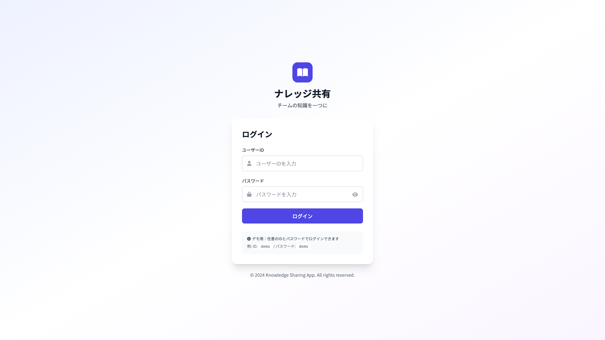

# 01_ログイン画面

## 1. 画面概要

ユーザー認証を行うログイン画面です。未ログイン状態でアプリにアクセスした場合、自動的にこの画面が表示されます。

## 2. 表示要件

### 2.1 アクセス条件
- **URL**: `/` または未認証時の自動リダイレクト
- **アクセス権限**: 全員（認証不要）

### 2.2 レスポンシブ対応
- **PC（1920×1080）**: 中央配置、最大幅512px
- **タブレット（1024×1366）**: 中央配置、パディング調整
- **モバイル（375×667）**: 全幅表示、パディング最小化

## 3. レイアウト構成

```
┌─────────────────────────────────┐
│      [ロゴアイコン + タイトル]      │
│      「ナレッジ共有」              │
│      「チームの知識を一つに」        │
├─────────────────────────────────┤
│  ┌───────────────────────────┐  │
│  │  ログインフォーム            │  │
│  │  ┌─────────────────────┐  │  │
│  │  │ ユーザーID入力欄      │  │  │
│  │  └─────────────────────┘  │  │
│  │  ┌─────────────────────┐  │  │
│  │  │ パスワード入力欄      │  │  │
│  │  │ [表示/非表示切り替え] │  │  │
│  │  └─────────────────────┘  │  │
│  │  [ログインボタン]           │  │
│  │  ─────────────────────────  │  │
│  │  [デモ用案内メッセージ]      │  │
│  └───────────────────────────┘  │
│                                  │
│  © 2024 Knowledge Sharing App    │
└─────────────────────────────────┘
```

## 4. UIコンポーネント一覧

| No. | コンポーネント名 | 種類 | 説明 |
|-----|----------------|------|------|
| 1 | ロゴアイコン | Icon | 本アイコン（Font Awesome） |
| 2 | タイトル | Heading | 「ナレッジ共有」 |
| 3 | サブタイトル | Text | 「チームの知識を一つに」 |
| 4 | エラーメッセージ | Alert | バリデーションエラー表示 |
| 5 | ユーザーID入力欄 | TextInput | テキスト入力フィールド |
| 6 | パスワード入力欄 | PasswordInput | パスワード入力フィールド（表示/非表示可） |
| 7 | パスワード表示切り替えボタン | Button | アイコン付きボタン |
| 8 | ログインボタン | Button | プライマリボタン |
| 9 | デモ用案内 | Info Box | グレー背景の情報ボックス |

## 5. 入力項目とバリデーション

### 5.1 ユーザーID

- **必須**: はい
- **型**: 文字列（テキスト）
- **プレースホルダー**: 「ユーザーIDを入力」
- **バリデーション**:
  - 空白不可
  - 1文字以上

### 5.2 パスワード

- **必須**: はい
- **型**: パスワード（非表示、表示切り替え可）
- **プレースホルダー**: 「パスワードを入力」
- **バリデーション**:
  - 空白不可
  - 1文字以上

## 6. アクション一覧

| No. | アクション名 | トリガー | 動作 | 遷移先 |
|-----|------------|---------|------|--------|
| 1 | パスワード表示/非表示 | アイコンボタンクリック | パスワードフィールドのtypeを切り替え | 画面内 |
| 2 | ログイン送信 | フォーム送信 or Enterキー | バリデーション → 認証処理 | ホーム画面（成功時） |
| 3 | エラー表示 | バリデーションエラー | エラーメッセージを表示 | 画面内 |

## 7. 画面キャプチャ

### PC版



### タブレット版


### モバイル版


## 8. 状態管理

### 8.1 状態変数

- `userId`: ユーザーID入力値
- `password`: パスワード入力値
- `showPassword`: パスワード表示/非表示フラグ
- `error`: エラーメッセージ
- `loading`: ローディング状態

### 8.2 初期状態

```javascript
{
  userId: '',
  password: '',
  showPassword: false,
  error: '',
  loading: false
}
```

## 9. 処理フロー

```
1. 画面表示
   ↓
2. ユーザーが入力
   ↓
3. [ログイン]ボタンクリック
   ↓
4. バリデーション実行
   ├─ NG → エラーメッセージ表示
   └─ OK → ローディング開始
       ↓
5. 認証API呼び出し（デモ版では任意の入力で成功）
   ↓
6. 認証成功
   ↓
7. ホーム画面へ遷移
```

## 10. デザイン仕様

### 10.1 カラーパレット

- **背景**: グラデーション（indigo-50 → white → purple-50）
- **フォーム背景**: 白（#FFFFFF）
- **プライマリカラー**: indigo-600（#4F46E5）
- **エラーカラー**: red-50背景、red-800テキスト

### 10.2 フォント

- **タイトル**: 3xl, bold
- **サブタイトル**: 通常, gray-600
- **ラベル**: sm, medium, gray-700

### 10.3 スペーシング

- **コンテナ最大幅**: max-w-md（448px）
- **パディング**: p-8（2rem）
- **フォーム要素間**: space-y-5

## 11. 制約事項

1. **デモ版の制約**:
   - 任意のユーザーID/パスワードでログイン可能
   - 実際の認証は行われない

2. **将来の実装**:
   - 実際の認証API連携が必要
   - パスワードリマインダー機能の追加
   - 2要素認証の対応

## 12. エラーハンドリング

| エラー種別 | エラーメッセージ | 表示方法 |
|-----------|----------------|---------|
| 未入力 | 「ユーザーIDとパスワードを入力してください」 | 赤背景のアラートボックス |
| 認証失敗 | 「ユーザーIDまたはパスワードが正しくありません」 | 赤背景のアラートボックス |
| ネットワークエラー | 「ネットワークエラーが発生しました」 | 赤背景のアラートボックス |

---

**文書管理情報**
- 作成日: 2024年12月22日
- バージョン: 1.0
- 最終更新日: 2024年12月22日

