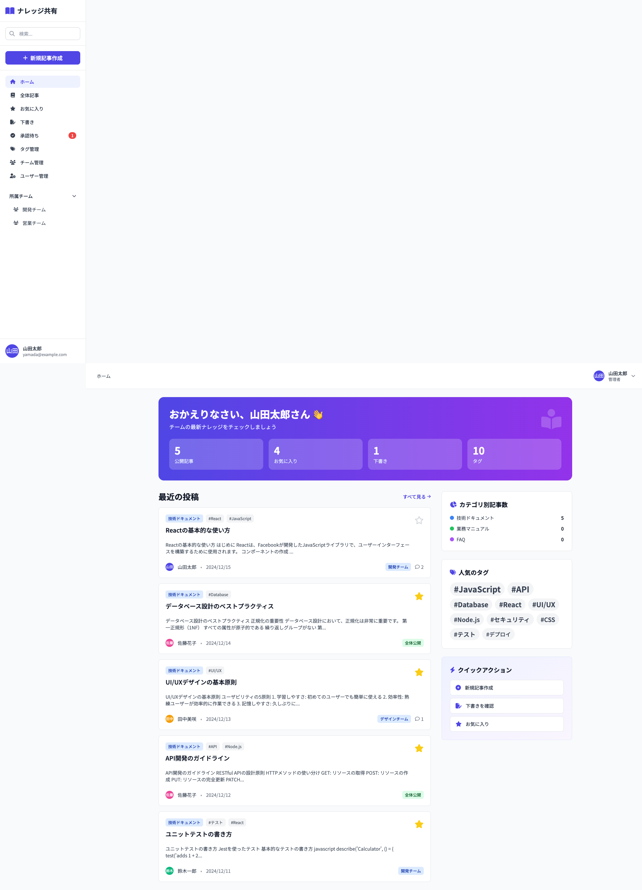

# 02_ホーム画面

## 1. 画面概要

ログイン後の初期画面として表示されるダッシュボードです。ユーザーの統計情報、最近の投稿、カテゴリ別記事数、人気のタグなどを表示します。

## 2. 表示要件

### 2.1 アクセス条件
- **URL**: `/home`
- **アクセス権限**: 認証済みユーザー全員
- **初期表示**: ログイン成功後、自動的に表示

### 2.2 レスポンシブ対応
- **PC**: 2カラムレイアウト（メイン + サイドバー）
- **タブレット**: 2カラムレイアウト（調整された幅）
- **モバイル**: 1カラムレイアウト（縦積み）

## 3. レイアウト構成

```
┌─────────────────────────────────────────────┐
│ [ウェルカムバナー]                            │
│ おかえりなさい、{ユーザー名}さん 👋          │
│ ┌──────┐ ┌──────┐ ┌──────┐ ┌──────┐       │
│ │公開  │ │お気  │ │下書き│ │タグ  │       │
│ │記事  │ │に入  │ │     │ │     │       │
│ │ 5    │ │ 4    │ │ 1   │ │ 10  │       │
│ └──────┘ └──────┘ └──────┘ └──────┘       │
├──────────────────┬──────────────────────────┤
│ [最近の投稿]      │ [カテゴリ別記事数]       │
│ ┌──────────────┐ │ 技術ドキュメント: 5      │
│ │ 記事カード1   │ │ 業務マニュアル: 0      │
│ │ ...          │ │ FAQ: 0                 │
│ └──────────────┘ ├──────────────────────────┤
│ ┌──────────────┐ │ [人気のタグ]            │
│ │ 記事カード2   │ │ #JavaScript #API ...    │
│ │ ...          │ │                        │
│ └──────────────┘ ├──────────────────────────┤
│ ... (最大10件)   │ [クイックアクション]      │
│                  │ - 新規記事作成           │
│                  │ - 下書きを確認           │
│                  │ - お気に入り             │
└──────────────────┴──────────────────────────┘
```

## 4. UIコンポーネント一覧

| No. | コンポーネント名 | 種類 | 説明 |
|-----|----------------|------|------|
| 1 | ウェルカムバナー | Banner | グラデーション背景、ユーザー名表示 |
| 2 | 統計カード | Card | 4つの数値カード（公開記事、お気に入り、下書き、タグ） |
| 3 | 記事カード | ArticleCard | 記事タイトル、カテゴリ、タグ、投稿者情報 |
| 4 | 「すべて見る」リンク | Link | 記事一覧画面へ遷移 |
| 5 | カテゴリ別記事数リスト | List | カテゴリ名と記事数のリスト表示 |
| 6 | タグクラウド | TagCloud | 人気タグをサイズと太さで表示 |
| 7 | クイックアクションボタン | Button | 新規記事作成、下書き確認、お気に入り |

## 5. 表示データ

### 5.1 統計情報（4つのカード）

1. **公開記事数**: `status='published'` の記事数
2. **お気に入り数**: 現在のユーザーがお気に入り登録した記事数
3. **下書き数**: 現在のユーザーが作成した `status='draft'` の記事数
4. **タグ数**: 登録されているタグの総数

### 5.2 最近の投稿

- **表示件数**: 最大10件
- **ソート**: 作成日時の降順（最新順）
- **フィルタ**: `status='published'` のみ

### 5.3 カテゴリ別記事数

- 全カテゴリを表示
- 各カテゴリの `status='published'` の記事数を表示
- 円グラフまたはリスト形式

### 5.4 人気のタグ

- **表示件数**: 最大15件
- **ソート**: 使用件数（count）の降順
- **表示方法**: タグクラウド形式
  - サイズ: 使用件数に応じて変化（text-base 〜 text-2xl）
  - 太さ: 使用件数に応じて変化（400 〜 700）

## 6. アクション一覧

| No. | アクション名 | トリガー | 動作 | 遷移先 |
|-----|------------|---------|------|--------|
| 1 | 記事カードクリック | 記事カードクリック | 記事詳細画面へ遷移 | 記事詳細画面 |
| 2 | お気に入りトグル | お気に入りアイコンクリック | お気に入り追加/削除 | 画面内（状態更新） |
| 3 | 「すべて見る」クリック | リンククリック | 全体記事一覧へ遷移 | 全体記事一覧 |
| 4 | タグクリック | タグボタンクリック | 検索画面へ遷移（タグ検索） | 検索結果画面 |
| 5 | 新規記事作成 | ボタンクリック | 記事作成画面へ遷移 | 記事作成画面 |
| 6 | 下書き確認 | ボタンクリック | 下書き一覧へ遷移 | 下書き一覧 |
| 7 | お気に入り確認 | ボタンクリック | お気に入り一覧へ遷移 | お気に入り一覧 |

## 7. 画面キャプチャ

### PC版



### タブレット版


### モバイル版


## 8. データ取得処理

```javascript
// 最近の投稿取得
const recentArticles = articles
  .filter(a => a.status === 'published')
  .sort((a, b) => new Date(b.createdAt) - new Date(a.createdAt))
  .slice(0, 10);

// カテゴリ別記事数
const categoryStats = categories.map(cat => ({
  ...cat,
  count: articles.filter(a => a.categoryId === cat.id && a.status === 'published').length
}));

// 人気のタグ
const tagCloud = tags
  .sort((a, b) => b.count - a.count)
  .slice(0, 15);
```

## 9. デザイン仕様

### 9.1 ウェルカムバナー

- **背景**: グラデーション（indigo-600 → purple-600）
- **テキスト色**: 白色
- **パディング**: p-8
- **角丸**: rounded-2xl

### 9.2 統計カード

- **背景**: 白、20%透明度（bg-opacity-20）
- **バックドロップ**: blur-sm
- **角丸**: rounded-xl
- **パディング**: p-4

### 9.3 レイアウト

- **グリッド**: `grid-cols-1 lg:grid-cols-3`
- **メインエリア**: `lg:col-span-2`
- **サイドバー**: `lg:col-span-1`

## 10. 制約事項

1. **表示件数**:
   - 最近の投稿: 最大10件
   - 人気のタグ: 最大15件

2. **パフォーマンス**:
   - 大量の記事がある場合、ページネーションを検討

---

**文書管理情報**
- 作成日: 2024年12月22日
- バージョン: 1.0
- 最終更新日: 2024年12月22日

