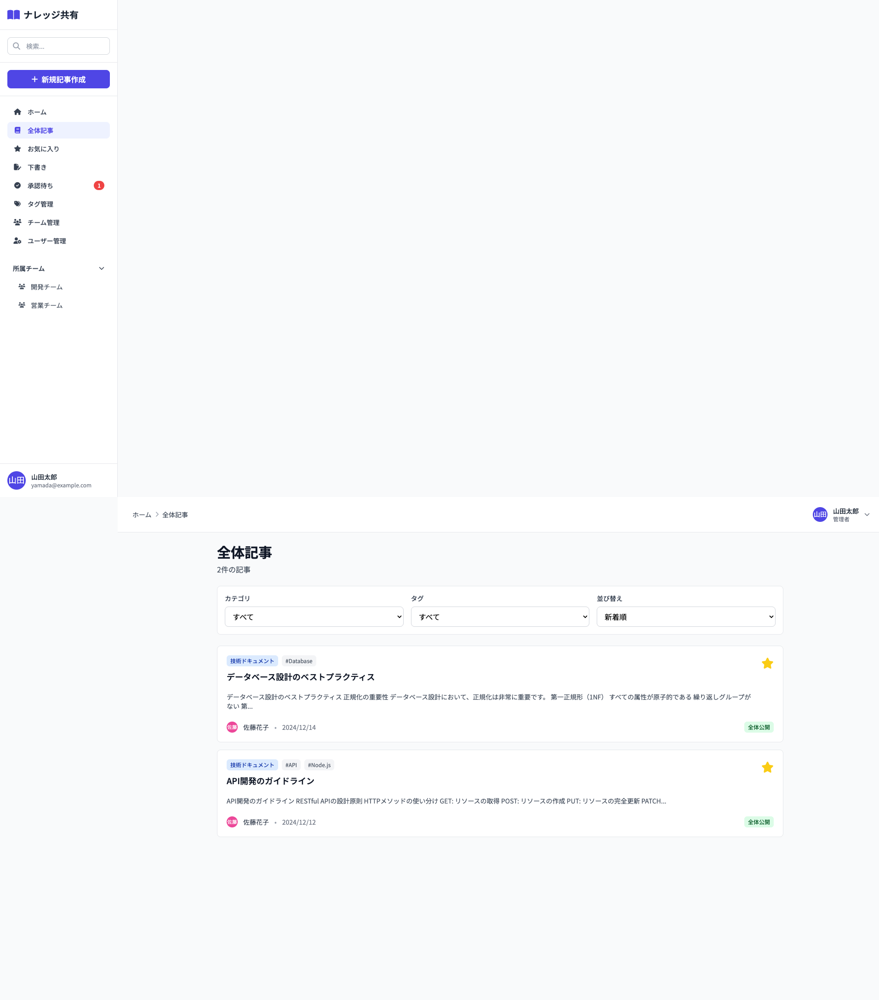

# 03_記事一覧画面

## 1. 画面概要

公開された記事の一覧を表示する画面です。全体記事一覧とチーム記事一覧の2種類があります。フィルタリング（カテゴリ、タグ）、並び替え、ページネーション機能を提供します。

## 2. 表示要件

### 2.1 アクセス条件
- **URL**: `/articles` (全体記事一覧) または `/teams/:teamId/articles` (チーム記事一覧)
- **アクセス権限**: 認証済みユーザー全員（チーム記事はチームメンバーのみ）

### 2.2 画面の種類
- **全体記事一覧**: `scope='public'` かつ `status='published'` の記事を表示
- **チーム記事一覧**: 指定されたチームに属する `status='published'` の記事を表示

### 2.3 レスポンシブ対応
- **PC**: 1カラムレイアウト、フィルターは3列グリッド
- **タブレット**: フィルターは3列グリッド（調整幅）
- **モバイル**: フィルターは1列、縦積み

## 3. レイアウト構成

```
┌─────────────────────────────────────────────┐
│ [画面タイトル]                               │
│ 全体記事 / {チーム名} の記事                │
│ {件数}件の記事                              │
│                                              │
│ [新規記事作成ボタン] (チーム記事のみ表示)   │
├─────────────────────────────────────────────┤
│ [フィルター]                                 │
│ ┌─────────┐ ┌─────────┐ ┌─────────┐        │
│ │カテゴリ │ │タグ     │ │並び替え│        │
│ └─────────┘ └─────────┘ └─────────┘        │
├─────────────────────────────────────────────┤
│ [記事リスト]                                 │
│ ┌───────────────────────────────────────┐   │
│ │ [記事カード1]                         │   │
│ │ - カテゴリバッジ                      │   │
│ │ - タグ                                │   │
│ │ - タイトル                             │   │
│ │ - 本文プレビュー                       │   │
│ │ - 投稿者情報                           │   │
│ │ - 公開範囲バッジ                       │   │
│ │ - お気に入りボタン                     │   │
│ └───────────────────────────────────────┘   │
│ ┌───────────────────────────────────────┐   │
│ │ [記事カード2]                         │   │
│ └───────────────────────────────────────┘   │
│ ...                                         │
├─────────────────────────────────────────────┤
│ [ページネーション]                           │
│ [<] [1] [2] [3] ... [>]                    │
└─────────────────────────────────────────────┘
```

## 4. UIコンポーネント一覧

| No. | コンポーネント名 | 種類 | 説明 |
|-----|----------------|------|------|
| 1 | 画面タイトル | Heading | 画面名と件数表示 |
| 2 | 新規記事作成ボタン | Button | チーム記事画面のみ表示 |
| 3 | カテゴリフィルター | Select | ドロップダウン選択 |
| 4 | タグフィルター | Select | ドロップダウン選択 |
| 5 | 並び替えセレクト | Select | 新着順/古い順/更新日順/人気順 |
| 6 | 記事カード | ArticleCard | 記事情報をカード形式で表示 |
| 7 | ページネーション | Pagination | ページ番号と前後ナビゲーション |
| 8 | 空状態メッセージ | Empty State | 記事がない場合の表示 |

## 5. フィルター機能

### 5.1 カテゴリフィルター
- **初期値**: 「すべて」
- **選択肢**: すべてのカテゴリ
- **動作**: 選択されたカテゴリの記事のみ表示

### 5.2 タグフィルター
- **初期値**: 「すべて」
- **選択肢**: すべてのタグ（#付きで表示）
- **動作**: 選択されたタグが含まれる記事のみ表示

### 5.3 並び替え
- **新着順**: 作成日時の降順（デフォルト）
- **古い順**: 作成日時の昇順
- **更新日順**: 更新日時の降順
- **人気順**: お気に入り数の降順

## 6. ページネーション

### 6.1 表示仕様
- **1ページあたりの件数**: 10件
- **最大表示ページ数**: 10ページ
- **省略表示**: 両端が離れている場合は「...」を表示

### 6.2 ナビゲーション
- **前へボタン**: 前のページに移動（1ページ目では無効化）
- **次へボタン**: 次のページに移動（最終ページでは無効化）
- **ページ番号クリック**: 該当ページに直接移動

## 7. アクション一覧

| No. | アクション名 | トリガー | 動作 | 遷移先 |
|-----|------------|---------|------|--------|
| 1 | 記事カードクリック | 記事カードクリック | 記事詳細画面へ遷移 | 記事詳細画面 |
| 2 | お気に入りトグル | お気に入りアイコンクリック | お気に入り追加/削除 | 画面内（状態更新） |
| 3 | カテゴリフィルター変更 | セレクト変更 | フィルター適用、1ページ目に戻る | 画面内 |
| 4 | タグフィルター変更 | セレクト変更 | フィルター適用、1ページ目に戻る | 画面内 |
| 5 | 並び替え変更 | セレクト変更 | ソート適用 | 画面内 |
| 6 | ページネーション | ページ番号/前後ボタンクリック | 該当ページに移動 | 画面内 |
| 7 | 新規記事作成 | ボタンクリック | 記事作成画面へ遷移 | 記事作成画面 |

## 8. 画面キャプチャ

### PC版



## 9. 状態管理

### 9.1 状態変数
- `currentPage`: 現在のページ番号（初期値: 1）
- `filterCategory`: カテゴリフィルター値（初期値: 'all'）
- `filterTag`: タグフィルター値（初期値: 'all'）
- `sortBy`: 並び替え種別（初期値: 'newest'）

## 10. データ処理フロー

```
1. 画面表示
   ↓
2. 記事データ取得・フィルタリング
   ├─ ステータス: published のみ
   ├─ スコープ: 全体記事なら public、チーム記事なら teamId 一致
   ├─ カテゴリフィルター適用
   └─ タグフィルター適用
   ↓
3. ソート処理
   ↓
4. ページネーション適用
   ↓
5. 記事カード表示
```

## 11. デザイン仕様

### 11.1 フィルターエリア
- **背景**: 白（bg-white）
- **ボーダー**: gray-200
- **パディング**: p-4
- **グリッド**: `grid-cols-1 md:grid-cols-3`

### 11.2 記事カード
- **間隔**: space-y-4
- **最大幅**: max-w-7xl

### 11.3 ページネーション
- **配置**: flex items-center justify-center
- **間隔**: space-x-2
- **アクティブページ**: bg-indigo-600 text-white

## 12. 制約事項

1. **表示件数**:
   - 1ページあたり最大10件
   - ページ数に制限なし

2. **フィルターの組み合わせ**:
   - カテゴリとタグは同時に適用可能
   - フィルター変更時は自動的に1ページ目に戻る

3. **チーム記事の権限**:
   - チームメンバーのみ閲覧可能
   - チームメンバーのみ新規記事作成可能

## 13. エラーハンドリング

| エラー種別 | エラーメッセージ | 表示方法 |
|-----------|----------------|---------|
| 記事なし | 「条件に一致する記事がありません」 | 空状態メッセージ |

---

**文書管理情報**
- 作成日: 2024年12月22日
- バージョン: 1.0
- 最終更新日: 2024年12月22日

