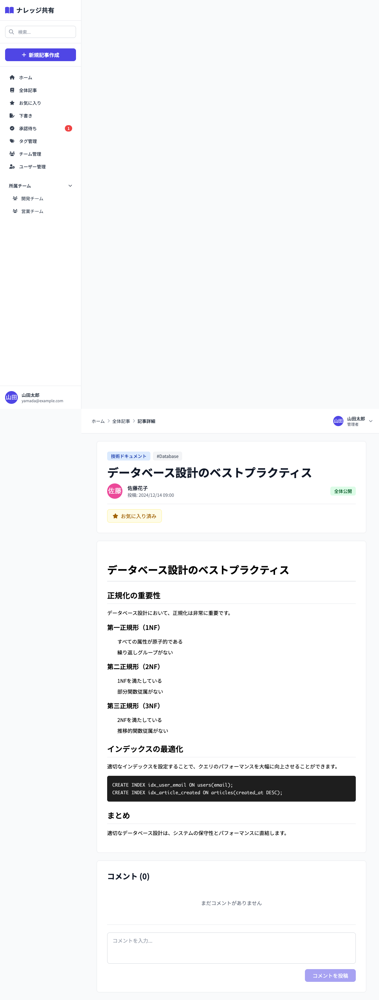

# 04_記事詳細画面

## 1. 画面概要

記事の詳細内容を表示する画面です。Markdown形式の本文をレンダリング表示し、コメントの投稿・閲覧・削除が可能です。

## 2. アクセス条件
- **URL**: `/articles/:id`
- **アクセス権限**: 認証済みユーザー全員
- **表示条件**: 記事の公開範囲に応じてアクセス制御

## 3. レイアウト構成

```
┌─────────────────────────────────────┐
│ [カテゴリバッジ] [タグ1] [タグ2]     │
│ [タイトル]                           │
│ [投稿者アバター + 名前] [日時]       │
│ [公開範囲バッジ]                     │
│ [お気に入り] [編集] [削除]           │
├─────────────────────────────────────┤
│ [本文エリア - Markdownレンダリング]  │
│ # 見出し1                           │
│ ## 見出し2                       │
│ ```コードブロック```                 │
│ ...                                 │
├─────────────────────────────────────┤
│ [コメントエリア]                     │
│ ┌───────────────────────────────┐ │
│ │ コメント1                     │ │
│ │ [投稿者] [日時] [削除]         │ │
│ └───────────────────────────────┘ │
│ ┌───────────────────────────────┐ │
│ │ コメント入力欄                  │ │
│ │ [投稿ボタン]                    │ │
│ └───────────────────────────────┘ │
└─────────────────────────────────────┘
```

## 4. UIコンポーネント

| No. | コンポーネント | 説明 |
|-----|--------------|------|
| 1 | カテゴリバッジ | カテゴリ名、色分け表示 |
| 2 | タグ一覧 | タグリスト表示 |
| 3 | タイトル | 大見出し（h1相当） |
| 4 | 投稿者情報 | アバター、名前、投稿日時 |
| 5 | 公開範囲バッジ | 「全体公開」「チーム名」 |
| 6 | アクションボタン | お気に入り、編集、削除 |
| 7 | 本文エリア | Markdownレンダリング結果 |
| 8 | コメント一覧 | コメントリスト |
| 9 | コメント入力欄 | テキストエリア |
| 10 | コメント投稿ボタン | 送信ボタン |

## 5. アクション

| アクション | 権限 | 動作 |
|-----------|------|------|
| お気に入り追加/削除 | 全員 | お気に入り状態をトグル |
| 記事編集 | 投稿者のみ | 記事編集画面へ遷移 |
| 記事削除 | 投稿者のみ | 確認後に削除 |
| コメント投稿 | 全員 | コメントを追加 |
| コメント削除 | 投稿者または記事作者 | コメントを削除 |

## 6. 画面キャプチャ



## 7. 制約事項

- **編集権限**: 記事の投稿者のみ編集可能
- **削除権限**: 記事の投稿者のみ削除可能
- **コメント削除権限**: コメント投稿者または記事作者のみ削除可能

---

**文書管理情報**
- 作成日: 2024年12月22日
- バージョン: 1.0

