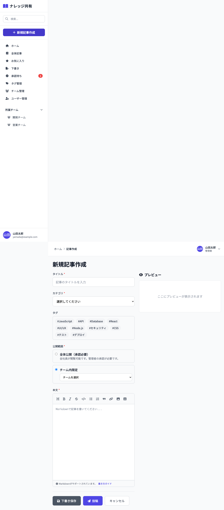

# 05_記事作成・編集画面

## 1. 画面概要

新規記事の作成または既存記事の編集を行う画面です。Markdownエディタを使用して本文を入力し、リアルタイムプレビュー機能を提供します。

## 2. 表示要件

### 2.1 アクセス条件
- **URL**: `/articles/new` (新規作成) または `/articles/:id/edit` (編集)
- **アクセス権限**: 
  - 新規作成: 認証済みユーザー全員
  - 編集: 記事の作成者のみ

### 2.2 レスポンシブ対応
- **PC**: 2カラムレイアウト（入力フォーム + プレビュー）
- **タブレット**: 2カラムレイアウト（調整幅）
- **モバイル**: タブ切り替え（入力/プレビュー）

## 3. レイアウト構成

### PC版
```
┌───────────────────────────────────────────────┐
│ [画面タイトル]                                 │
│ 新規記事作成 / 記事を編集                      │
├──────────────────┬───────────────────────────┤
│ [入力フォーム]    │ [プレビュー]              │
│                  │                            │
│ タイトル *       │ ┌─────────────────────┐   │
│ [入力欄]         │ │ プレビュー           │   │
│                  │ │ # {タイトル}         │   │
│ カテゴリ *       │ │ ...                 │   │
│ [セレクト]       │ └─────────────────────┘   │
│                  │                            │
│ タグ             │                            │
│ [#Tag1] [#Tag2] │                            │
│                  │                            │            │
│ 公開範囲 *       │                            │
│ ○ 全体公開       │                            │
│ ● チーム内限定    │                            │
│   [チーム選択]    │                            │
│                  │                            │
│ 本文 *           │                            │
│ ┌─────────────┐ │                            │
│ │[ツールバー] │ │                            │
│ │[Markdown入力]│ │                            │
│ └─────────────┘ │                            │
│                  │                            │
│ [下書き保存] [投稿] [キャンセル]              │
└──────────────────┴───────────────────────────┘
```

### モバイル版
```
┌─────────────────────────────────────────────┐
│ [画面タイトル]                               │
│ [入力] [プレビュー] ← タブ切り替え           │
├─────────────────────────────────────────────┤
│ [入力フォーム] (表示中タブ)                 │
│ ... (PC版と同様)                            │
└─────────────────────────────────────────────┘
```

## 4. UIコンポーネント一覧

| No. | コンポーネント名 | 種類 | 説明 |
|-----|----------------|------|------|
| 1 | タイトル入力欄 | TextInput | 必須項目 |
| 2 | カテゴリセレクト | Select | 必須項目 |
| 3 | タグ選択ボタン | Button | 複数選択可能 |
| 4 | 公開範囲ラジオ | Radio | 全体公開/チーム内限定 |
| 5 | チームセレクト | Select | チーム内限定選択時表示 |
| 6 | Markdownエディタ | MarkdownEditor | ツールバー付きエディタ |
| 7 | プレビューエリア | Preview | Markdownレンダリング結果 |
| 8 | 下書き保存ボタン | Button | グレー背景 |
| 9 | 投稿ボタン | Button | プライマリボタン |
| 10 | キャンセルボタン | Button | 白背景、ボーダー |

## 5. 入力項目とバリデーション

### 5.1 タイトル
- **必須**: はい
- **型**: 文字列（テキスト）
- **プレースホルダー**: 「記事のタイトルを入力」
- **バリデーション**: 空白不可

### 5.2 カテゴリ
- **必須**: はい
- **型**: セレクト
- **初期値**: 「選択してください」
- **バリデーション**: 選択必須

### 5.3 タグ
- **必須**: いいえ
- **型**: 複数選択ボタン
- **選択方法**: クリックでトグル（選択済み: indigo-600背景）
- **表示**: タグ名に#付きで表示

### 5.4 公開範囲
- **必須**: はい
- **型**: ラジオボタン
- **選択肢**:
  - 全体公開（承認必要）: `scope='public'`、管理者承認必要
  - チーム内限定: `scope='team'`、チーム選択必須

### 5.5 チーム選択
- **必須**: 公開範囲が「チーム内限定」の場合のみ
- **型**: セレクト
- **選択肢**: 現在のユーザーが所属するアクティブなチームのみ

### 5.6 本文
- **必須**: 投稿時のみ（下書き保存時は不要）
- **型**: Markdownテキスト
- **プレースホルダー**: 「Markdownで記事を書いてください...」
- **バリデーション**: 投稿時は空白不可

## 6. Markdownエディタ機能

### 6.1 ツールバー機能
- **Bold** (太字): `**text**`
- **Italic** (斜体): `*text*`
- **Heading** (見出し): `#`, `##`, `###`
- **Link** (リンク): `[text](url)`
- **Code** (コード): `` `code` ``
- **Code Block** (コードブロック): ``` ``` ```
- **List** (リスト): `- item`
- **Blockquote** (引用): `> text`
- **Image** (画像): ``
- **Table** (表): テーブル構文

### 6.2 プレビュー機能
- **リアルタイム**: 入力内容をリアルタイムでプレビュー表示
- **シンタックスハイライト**: コードブロックにシンタックスハイライト適用
- **スタイリング**: Markdownスタイルシートで整形表示

## 7. アクション一覧

| No. | アクション名 | トリガー | 動作 | 遷移先 |
|-----|------------|---------|------|--------|
| 1 | タグトグル | タグボタンクリック | 選択状態を切り替え | 画面内 |
| 2 | 公開範囲変更 | ラジオボタン選択 | 公開範囲とUIを更新 | 画面内 |
| 3 | ツールバーボタン | 各ツールボタンクリック | 該当Markdown構文を挿入 | 画面内 |
| 4 | 下書き保存 | 下書き保存ボタンクリック | バリデーション（タイトルのみ） → 保存 | 下書き一覧 |
| 5 | 投稿 | 投稿ボタンクリック | 全項目バリデーション → 投稿処理 | ホーム画面 or 記事詳細 |
| 6 | キャンセル | キャンセルボタンクリック | 確認ダイアログ → 編集内容破棄 | ホーム画面 or 記事詳細 |
| 7 | モバイルタブ切替 | 入力/プレビュータブクリック | 表示タブを切り替え | 画面内 |

## 8. 画面キャプチャ

### PC版



## 9. 状態管理

### 9.1 状態変数
- `title`: タイトル入力値
- `content`: 本文入力値
- `categoryId`: 選択されたカテゴリID
- `selectedTags`: 選択されたタグID配列
- `scope`: 公開範囲（'public' or 'team'）
- `selectedTeam`: 選択されたチームID（scope='team'時）
- `activeTab`: モバイル表示時のタブ（'edit' or 'preview'）
- `loading`: 保存/投稿処理中のフラグ

### 9.2 初期状態（新規作成）
```javascript
{
  title: '',
  content: '',
  categoryId: '',
  selectedTags: [],
  scope: 'team',
  selectedTeam: teamId || '',
  activeTab: 'edit',
  loading: false
}
```

### 9.3 初期状態（編集）
- 既存記事のデータをロードして各状態変数に設定

## 10. 処理フロー

### 10.1 下書き保存フロー
```
1. [下書き保存]ボタンクリック
   ↓
2. タイトルバリデーション
   ├─ NG → アラート表示
   └─ OK → ローディング開始
       ↓
3. 下書き保存処理
   ↓
4. 下書き一覧画面へ遷移
```

### 10.2 投稿フロー
```
1. [投稿]ボタンクリック
   ↓
2. 全項目バリデーション
   ├─ NG → アラート表示
   └─ OK → ローディング開始
       ↓
3. 公開範囲に応じた処理
   ├─ public → 承認待ち状態で保存、トースト表示
   └─ team → 公開状態で保存、トースト表示
       ↓
4. ホーム画面へ遷移
```

### 10.3 キャンセルフロー
```
1. [キャンセル]ボタンクリック
   ↓
2. 確認ダイアログ表示
   ├─ キャンセル → 処理中断
   └─ OK → 編集内容を破棄
       ↓
3. 前画面（ホーム or 記事詳細）へ遷移
```

## 11. デザイン仕様

### 11.1 レイアウト
- **PC**: `grid-cols-1 lg:grid-cols-2`
- **モバイル**: タブ切り替え（`lg:hidden` と `hidden lg:block`）

### 11.2 入力フィールド
- **スタイル**: `border-gray-300 rounded-lg focus:ring-2 focus:ring-indigo-500`
- **パディング**: `px-4 py-3` (タイトル、カテゴリ) / `px-4 py-2` (その他)

### 11.3 タグ選択
- **選択済み**: `bg-indigo-600 text-white`
- **未選択**: `bg-gray-100 text-gray-700 hover:bg-gray-200`
- **配置**: flex wrap

### 11.4 プレビューエリア
- **位置**: `sticky top-24` (PC版)
- **最大高さ**: `max-h-[calc(100vh-200px)]`
- **スクロール**: `overflow-y-auto`
- **スタイリング**: `markdown-body prose max-w-none`

## 12. 制約事項

1. **権限制限**:
   - 編集は記事作成者のみ可能
   - チーム選択は所属チームのみ表示

2. **バリデーション**:
   - 下書き保存時はタイトルのみ必須
   - 投稿時は全必須項目（タイトル、カテゴリ、公開範囲、本文）が必須

3. **公開範囲**:
   - 全体公開は管理者の承認が必要（status='pending'）
   - チーム内限定は即座に公開（status='published'）

## 13. エラーハンドリング

| エラー種別 | エラーメッセージ | 表示方法 |
|-----------|----------------|---------|
| タイトル未入力 | 「タイトルを入力してください」 | alert |
| 本文未入力 | 「本文を入力してください」 | alert |
| カテゴリ未選択 | 「カテゴリを選択してください」 | alert |
| チーム未選択 | 「チームを選択してください」 | alert |
| 保存失敗 | 「保存に失敗しました」 | トースト通知 |
| 投稿失敗 | 「投稿に失敗しました」 | トースト通知 |

---

**文書管理情報**
- 作成日: 2024年12月22日
- バージョン: 1.0
- 最終更新日: 2024年12月22日

