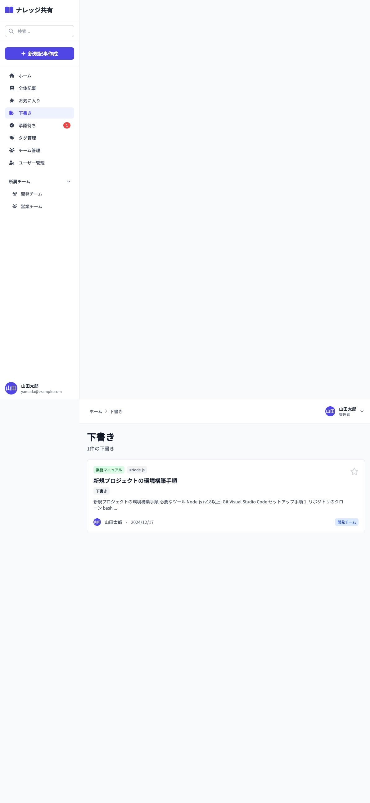

# 06_下書き一覧画面

## 1. 画面概要

現在のユーザーが作成した下書き記事の一覧を表示する画面です。差し戻しされた記事も下書きとして表示されます。

## 2. 表示要件

### 2.1 アクセス条件
- **URL**: `/drafts`
- **アクセス権限**: 認証済みユーザー全員
- **表示データ**: 
  - 現在のユーザーが作成した `status='draft'` の記事
  - 差し戻しされた記事（`rejectionReason` が存在する記事）

### 2.2 レスポンシブ対応
- **PC**: 1カラムレイアウト、記事カードを縦並び
- **タブレット**: 1カラムレイアウト
- **モバイル**: 1カラムレイアウト

## 3. レイアウト構成

```
┌─────────────────────────────────────────────┐
│ [画面タイトル]                               │
│ 下書き                                      │
│ {件数}件の下書き                            │
├─────────────────────────────────────────────┤
│ [記事リスト]                                 │
│ ┌───────────────────────────────────────┐   │
│ │ [差し戻しバッジ] (該当時のみ)          │   │
│ │ [記事カード]                           │   │
│ │ - カテゴリバッジ                       │   │
│ │ - タグ                                 │   │
│ │ - タイトル                             │   │
│ │ - 本文プレビュー                       │   │
│ │ - 投稿者情報                           │   │
│ │ - 公開範囲バッジ                       │   │
│ │ - お気に入りボタン                     │   │
│ └───────────────────────────────────────┘   │
│ ...                                         │
└─────────────────────────────────────────────┘
```

空状態:
```
┌─────────────────────────────────────────────┐
│ [空状態アイコン]                             │
│ 📝                                          │
│                                             │
│ 下書きはありません                           │
│                                             │
│ [新規記事を作成] ボタン                     │
└─────────────────────────────────────────────┘
```

## 4. UIコンポーネント一覧

| No. | コンポーネント名 | 種類 | 説明 |
|-----|----------------|------|------|
| 1 | 画面タイトル | Heading | 「下書き」と件数 |
| 2 | 記事カード | ArticleCard | 他の画面と同じカードコンポーネント |
| 3 | 差し戻しバッジ | Badge | 差し戻し記事のみ表示 |
| 4 | 空状態アイコン | Icon | ファイルペンアイコン |
| 5 | 新規記事作成ボタン | Button | 空状態時のみ表示 |

## 5. 表示データ

### 5.1 フィルタリング条件
- `authorId === currentUser.id`: 現在のユーザーが作成した記事のみ
- `status === 'draft'`: 下書き状態の記事
- `rejectionReason` が存在: 差し戻しされた記事も含む

### 5.2 ソート
- デフォルト: ソートなし（データの元の順序）

## 6. アクション一覧

| No. | アクション名 | トリガー | 動作 | 遷移先 |
|-----|------------|---------|------|--------|
| 1 | 記事カードクリック | 記事カードクリック | 記事詳細画面へ遷移 | 記事詳細画面 |
| 2 | お気に入りトグル | お気に入りアイコンクリック | お気に入り追加/削除 | 画面内（状態更新） |
| 3 | 新規記事作成 | 空状態のボタンクリック | 記事作成画面へ遷移 | 記事作成画面 |

## 7. 画面キャプチャ

### PC版



## 8. 差し戻しバッジ

### 8.1 表示条件
- 記事に `rejectionReason` が存在する場合のみ表示
- 記事カードの右上（絶対配置）に表示

### 8.2 スタイル
- **背景**: `bg-red-100`
- **テキスト**: `text-red-800`
- **サイズ**: `px-3 py-1 rounded-full text-xs font-medium`

## 9. デザイン仕様

### 9.1 レイアウト
- **最大幅**: `max-w-7xl mx-auto`
- **パディング**: `p-6`
- **記事間隔**: `space-y-4`

### 9.2 空状態
- **アイコンサイズ**: `text-5xl text-gray-300`
- **メッセージ**: `text-gray-500`
- **ボタン**: `bg-indigo-600 hover:bg-indigo-700 text-white`

### 9.3 差し戻しバッジ
- **位置**: `absolute top-4 right-4`
- **色**: 赤系（red-100背景、red-800テキスト）

## 10. 制約事項

1. **表示権限**:
   - 自分の下書きのみ表示可能
   - 他のユーザーの下書きは表示されない

2. **差し戻し記事**:
   - `rejectionReason` が存在する記事は「差し戻し」バッジを表示
   - 差し戻し理由は記事詳細画面で確認可能（将来的な機能）

## 11. エラーハンドリング

| エラー種別 | エラーメッセージ | 表示方法 |
|-----------|----------------|---------|
| 下書きなし | 「下書きはありません」 | 空状態メッセージ |

---

**文書管理情報**
- 作成日: 2024年12月22日
- バージョン: 1.0
- 最終更新日: 2024年12月22日

