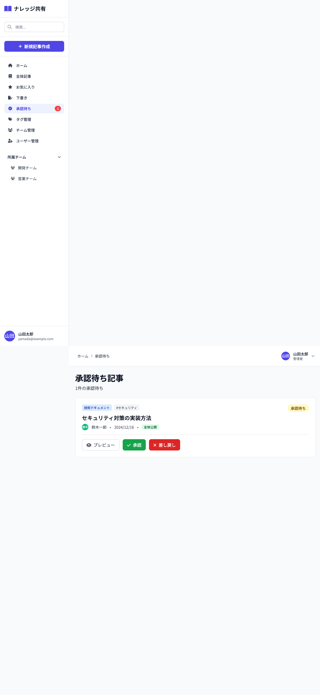

# 07_承認待ち一覧画面

## 1. 画面概要

全体公開として投稿された記事の承認待ち一覧を表示する画面です。管理者・リーダーが記事を承認または差し戻しすることができます。

## 2. 表示要件

### 2.1 アクセス条件
- **URL**: `/approval`
- **アクセス権限**: 管理者（admin）・チームリーダー（leader）のみ
- **表示データ**: `status='pending'` の記事（全体公開申請された記事）

### 2.2 レスポンシブ対応
- **PC**: 1カラムレイアウト、記事カードを縦並び
- **タブレット**: 1カラムレイアウト
- **モバイル**: 1カラムレイアウト

## 3. レイアウト構成

```
┌─────────────────────────────────────────────┐
│ [画面タイトル]                               │
│ 承認待ち記事                                 │
│ {件数}件の承認待ち                           │
├─────────────────────────────────────────────┤
│ [記事リスト]                                 │
│ ┌───────────────────────────────────────┐   │
│ │ [カテゴリバッジ] [タグ]                │   │
│ │ [タイトル]                             │   │
│ │ [投稿者] [日時] [全体公開バッジ]       │   │
│ │ [承認待ちバッジ]                       │   │
│ ├───────────────────────────────────────┤   │
│ │ [プレビュー] [承認] [差し戻し]        │   │
│ └───────────────────────────────────────┘   │
│ ...                                         │
└─────────────────────────────────────────────┘
```

空状態:
```
┌─────────────────────────────────────────────┐
│ [空状態アイコン]                             │
│ ✓                                           │
│                                             │
│ 承認待ちの記事はありません                   │
└─────────────────────────────────────────────┘
```

差し戻しモーダル:
```
┌─────────────────────────────────────────────┐
│ [モーダル] 記事を差し戻し                    │
├─────────────────────────────────────────────┤
│ 「{タイトル}」を差し戻します。理由を入力     │
│ してください。                               │
│                                             │
│ [差し戻し理由入力欄]                        │
│ (複数行テキストエリア)                      │
│                                             │
│ [キャンセル] [差し戻す]                     │
└─────────────────────────────────────────────┘
```

## 4. UIコンポーネント一覧

| No. | コンポーネント名 | 種類 | 説明 |
|-----|----------------|------|------|
| 1 | 画面タイトル | Heading | 「承認待ち記事」と件数 |
| 2 | 記事カード | Card | 記事情報をカード形式で表示 |
| 3 | カテゴリバッジ | Badge | カテゴリ名、色分け |
| 4 | タグバッジ | Badge | タグ名（最大3つ表示） |
| 5 | 投稿者情報 | User Info | アバター、名前 |
| 6 | 日時 | Date | 作成日時 |
| 7 | 公開範囲バッジ | Badge | 「全体公開」 |
| 8 | 承認待ちバッジ | Badge | 「承認待ち」（黄色） |
| 9 | プレビューボタン | Button | 記事詳細へ遷移 |
| 10 | 承認ボタン | Button | 記事を承認 |
| 11 | 差し戻しボタン | Button | 差し戻しモーダルを表示 |
| 12 | 差し戻しモーダル | Modal | 差し戻し理由入力 |
| 13 | 空状態アイコン | Icon | チェックサークルアイコン |

## 5. アクション一覧

| No. | アクション名 | トリガー | 動作 | 遷移先 |
|-----|------------|---------|------|--------|
| 1 | プレビュー | プレビューボタンクリック | 記事詳細画面へ遷移 | 記事詳細画面 |
| 2 | 承認 | 承認ボタンクリック | 確認ダイアログ → 承認処理 | 画面内（状態更新） |
| 3 | 差し戻し | 差し戻しボタンクリック | 差し戻しモーダル表示 | 画面内 |
| 4 | 差し戻し実行 | モーダル内「差し戻す」ボタンクリック | 理由バリデーション → 差し戻し処理 | 画面内（状態更新） |
| 5 | モーダルキャンセル | キャンセルボタンクリック | モーダルを閉じる | 画面内 |

## 6. 承認処理

### 6.1 承認フロー
```
1. [承認]ボタンクリック
   ↓
2. 確認ダイアログ表示
   ├─ キャンセル → 処理中断
   └─ OK → 承認処理実行
       ↓
3. 記事のstatusを'published'に更新
   ↓
4. トースト通知表示
   ↓
5. 一覧から該当記事を削除
```

### 6.2 差し戻しフロー
```
1. [差し戻し]ボタンクリック
   ↓
2. 差し戻しモーダル表示
   ↓
3. 理由入力（必須）
   ↓
4. [差し戻す]ボタンクリック
   ↓
5. 理由バリデーション
   ├─ NG → アラート表示
   └─ OK → 差し戻し処理実行
       ↓
6. 記事のstatusを'published'から'draft'に更新
   ↓
7. rejectionReasonを設定
   ↓
8. トースト通知表示
   ↓
9. 一覧から該当記事を削除（下書き一覧に移動）
```

## 7. 画面キャプチャ

### PC版



## 8. 状態管理

### 8.1 状態変数
- `showRejectModal`: 差し戻しモーダルの表示フラグ
- `selectedArticle`: 選択された記事オブジェクト
- `rejectReason`: 差し戻し理由の入力値

### 8.2 初期状態
```javascript
{
  showRejectModal: false,
  selectedArticle: null,
  rejectReason: ''
}
```

## 9. バリデーション

### 9.1 差し戻し理由
- **必須**: はい
- **型**: 複数行テキスト
- **プレースホルダー**: 「差し戻し理由を入力...」
- **バリデーション**: 空白不可

## 10. デザイン仕様

### 10.1 記事カード
- **背景**: 白（bg-white）
- **ボーダー**: gray-200
- **パディング**: `p-6`
- **角丸**: `rounded-lg`

### 10.2 バッジ
- **承認待ち**: `bg-yellow-100 text-yellow-800`
- **全体公開**: `bg-green-100 text-green-800`
- **カテゴリ**: カテゴリの色設定に従う

### 10.3 ボタン
- **プレビュー**: `bg-white border-gray-300 text-gray-700 hover:bg-gray-50`
- **承認**: `bg-green-600 hover:bg-green-700 text-white`
- **差し戻し**: `bg-red-600 hover:bg-red-700 text-white`

### 10.4 モーダル
- **サイズ**: `md` (最大幅)
- **背景オーバーレイ**: 半透明グレー
- **ボーダー**: `rounded-lg`

## 11. 制約事項

1. **アクセス権限**:
   - 管理者（admin）とチームリーダー（leader）のみアクセス可能
   - 一般ユーザー（member）はアクセス不可

2. **承認対象**:
   - `status='pending'` かつ `scope='public'` の記事のみ表示
   - チーム内限定記事は承認不要（即公開）

3. **承認後の動作**:
   - 承認後、記事は `status='published'` に変更
   - 一覧から自動的に削除される

4. **差し戻し後の動作**:
   - 差し戻し後、記事は `status='draft'` に変更
   - `rejectionReason` が設定される
   - 一覧から自動的に削除され、投稿者の下書き一覧に移動

## 12. エラーハンドリング

| エラー種別 | エラーメッセージ | 表示方法 |
|-----------|----------------|---------|
| 承認待ちなし | 「承認待ちの記事はありません」 | 空状態メッセージ |
| 差し戻し理由未入力 | 「差し戻し理由を入力してください」 | alert |
| 承認失敗 | 「承認に失敗しました」 | トースト通知 |
| 差し戻し失敗 | 「差し戻しに失敗しました」 | トースト通知 |

## 13. 確認ダイアログ

### 13.1 承認確認
- **メッセージ**: 「この記事を承認しますか？」
- **ボタン**: OK / キャンセル

---

**文書管理情報**
- 作成日: 2024年12月22日
- バージョン: 1.0
- 最終更新日: 2024年12月22日

