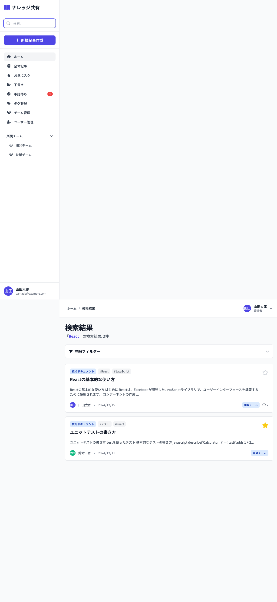

# 08_検索結果画面

## 1. 画面概要

キーワード検索の結果を表示する画面です。タイトル、本文、タグ、投稿者での検索が可能で、詳細フィルター機能も提供します。

## 2. 表示要件

### 2.1 アクセス条件
- **URL**: `/search?q=:query`
- **アクセス権限**: 認証済みユーザー全員
- **検索対象**: `status='published'` の記事のみ

### 2.2 レスポンシブ対応
- **PC**: 1カラムレイアウト、フィルターは展開表示
- **タブレット**: 1カラムレイアウト、フィルターは折りたたみ可能
- **モバイル**: 1カラムレイアウト、フィルターは折りたたみ可能

## 3. レイアウト構成

```
┌─────────────────────────────────────────────┐
│ [画面タイトル]                                 │
│ 検索結果                                      │
│ 「{検索キーワード}」の検索結果: {件数}件       │
├─────────────────────────────────────────────┤
│ [詳細フィルター] (折りたたみ可能)             │
│ ▼ 詳細フィルター                              │
│ ┌─────────────────────────────────────────┐   │
│ │ [検索対象]                              │   │
│ │ ☑ タイトル ☑ 本文 ☑ タグ ☑ 投稿者      │   │
│ │                                         │   │
│ │ [カテゴリ] [公開範囲] [日付範囲]        │   │
│ │ [セレクト] [セレクト] [開始日] [終了日] │   │
│ └─────────────────────────────────────────┘   │
├─────────────────────────────────────────────┤
│ [検索結果リスト]                             │
│ ┌───────────────────────────────────────┐   │
│ │ [記事カード]                           │   │
│ │ - ハイライト表示されたキーワード        │   │
│ │ - カテゴリ、タグ                        │   │
│ │ - タイトル                              │   │
│ │ - 本文プレビュー                        │   │
│ │ - 投稿者情報                            │   │
│ │ - お気に入りボタン                      │   │
│ └───────────────────────────────────────┘   │
│ ...                                         │
└─────────────────────────────────────────────┘
```

空状態:
```
┌─────────────────────────────────────────────┐
│ [空状態アイコン]                             │
│ 🔍                                          │
│                                             │
│ 検索条件に一致する記事が見つかりませんでした  │
│                                             │
│ 別のキーワードで検索してみてください         │
└─────────────────────────────────────────────┘
```

## 4. UIコンポーネント一覧

| No. | コンポーネント名 | 種類 | 説明 |
|-----|----------------|------|------|
| 1 | 画面タイトル | Heading | 検索キーワードと件数 |
| 2 | フィルター展開ボタン | Button | 詳細フィルターの表示/非表示 |
| 3 | 検索対象チェックボタン | Button | タイトル/本文/タグ/投稿者 |
| 4 | カテゴリフィルター | Select | カテゴリ選択 |
| 5 | 公開範囲フィルター | Select | 全体公開/チーム限定 |
| 6 | 日付範囲入力 | Date Input | 開始日・終了日 |
| 7 | 記事カード | ArticleCard | ハイライト表示対応 |
| 8 | ハイライトマーク | Mark | 検索キーワードのハイライト |
| 9 | 空状態アイコン | Icon | 検索アイコン |

## 5. 検索機能

### 5.1 検索対象
- **タイトル**: 記事タイトル内の検索
- **本文**: 記事本文（Markdown）内の検索
- **タグ**: タグ名での検索
- **投稿者**: 投稿者名での検索

### 5.2 検索方法
- 複数の検索対象を同時に選択可能
- OR条件で検索（いずれかの対象で一致すれば表示）
- 大文字小文字を区別しない

### 5.3 ハイライト表示
- 検索キーワードが記事タイトル・本文に含まれる場合、黄色背景でハイライト表示
- 正規表現を使用して部分一致検索

## 6. 詳細フィルター

### 6.1 フィルター項目
1. **検索対象**: タイトル/本文/タグ/投稿者のチェックボタン（複数選択可）
2. **カテゴリ**: ドロップダウン選択（デフォルト: すべて）
3. **公開範囲**: ドロップダウン選択（すべて/全体公開/チーム限定）
4. **日付範囲**: 開始日と終了日の日付入力

### 6.2 フィルター適用
- 各フィルターはAND条件で適用
- フィルター変更時、リアルタイムで検索結果を更新

## 7. アクション一覧

| No. | アクション名 | トリガー | 動作 | 遷移先 |
|-----|------------|---------|------|--------|
| 1 | フィルター展開/折りたたみ | フィルターボタンクリック | フィルターエリアの表示/非表示 | 画面内 |
| 2 | 検索対象トグル | 検索対象ボタンクリック | 検索対象の選択/解除 | 画面内（結果更新） |
| 3 | カテゴリフィルター変更 | セレクト変更 | カテゴリフィルター適用 | 画面内（結果更新） |
| 4 | 公開範囲フィルター変更 | セレクト変更 | 公開範囲フィルター適用 | 画面内（結果更新） |
| 5 | 日付範囲変更 | 日付入力変更 | 日付フィルター適用 | 画面内（結果更新） |
| 6 | 記事カードクリック | 記事カードクリック | 記事詳細画面へ遷移 | 記事詳細画面 |
| 7 | お気に入りトグル | お気に入りアイコンクリック | お気に入り追加/削除 | 画面内（状態更新） |

## 8. 画面キャプチャ

### PC版



## 9. 状態管理

### 9.1 状態変数
- `query`: 検索キーワード（URLパラメータから取得）
- `searchTargets`: 検索対象配列（初期値: ['title', 'content', 'tags', 'author']）
- `filterCategory`: カテゴリフィルター値（初期値: 'all'）
- `filterScope`: 公開範囲フィルター値（初期値: 'all'）
- `dateFrom`: 開始日（初期値: ''）
- `dateTo`: 終了日（初期値: ''）
- `showFilters`: フィルター展開フラグ（初期値: false）

## 10. 検索処理フロー

```
1. 検索キーワード取得（URLパラメータ）
   ↓
2. 検索対象でフィルタリング
   ├─ タイトル検索
   ├─ 本文検索
   ├─ タグ検索
   └─ 投稿者検索
   ↓
3. 詳細フィルター適用
   ├─ カテゴリフィルター
   ├─ 公開範囲フィルター
   └─ 日付範囲フィルター
   ↓
4. 検索結果表示（ハイライト適用）
```

## 11. ハイライト機能

### 11.1 実装方法
- `highlightText(text, query)` 関数でキーワードをハイライト
- 正規表現で大文字小文字を区別せず検索
- `<mark>` タグでハイライト表示（`bg-yellow-200`）

### 11.2 適用箇所
- 記事タイトル
- 本文プレビュー（該当箇所のみ）

## 12. デザイン仕様

### 12.1 フィルターエリア
- **背景**: 白（bg-white）
- **ボーダー**: gray-200
- **展開ボタン**: `hover:bg-gray-50`
- **折りたたみアイコン**: `fa-chevron-down/up`

### 12.2 検索対象ボタン
- **選択済み**: `bg-indigo-600 text-white`
- **未選択**: `bg-gray-100 text-gray-700 hover:bg-gray-200`
- **アイコン**: `fa-check-square` / `fa-square`

### 12.3 ハイライト
- **背景**: `bg-yellow-200`
- **テキスト**: 元のテキスト色を維持

### 12.4 空状態
- **アイコンサイズ**: `text-5xl text-gray-300`
- **メッセージ**: 2行表示

## 13. 制約事項

1. **検索対象**:
   - 最低1つの検索対象を選択する必要がある
   - すべての対象を解除すると検索結果が空になる

2. **日付範囲**:
   - 開始日のみ指定可能（終了日は任意）
   - 終了日のみ指定可能（開始日は任意）
   - 両方指定して範囲検索も可能

3. **パフォーマンス**:
   - 大量の記事がある場合、検索処理の最適化が必要

## 14. エラーハンドリング

| エラー種別 | エラーメッセージ | 表示方法 |
|-----------|----------------|---------|
| 検索結果なし | 「検索条件に一致する記事が見つかりませんでした」 | 空状態メッセージ |
| キーワード未入力 | 検索結果画面が表示されない | - |

---

**文書管理情報**
- 作成日: 2024年12月22日
- バージョン: 1.0
- 最終更新日: 2024年12月22日

