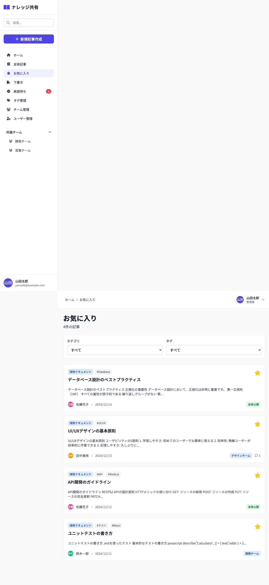

# 09_お気に入り一覧画面

## 1. 画面概要

現在のユーザーがお気に入り登録した記事の一覧を表示する画面です。カテゴリとタグでフィルタリング可能です。

## 2. 表示要件

### 2.1 アクセス条件
- **URL**: `/favorites`
- **アクセス権限**: 認証済みユーザー全員
- **表示データ**: 現在のユーザーがお気に入り登録した `status='published'` の記事

### 2.2 レスポンシブ対応
- **PC**: 1カラムレイアウト、フィルターは2列グリッド
- **タブレット**: 1カラムレイアウト、フィルターは2列グリッド
- **モバイル**: 1カラムレイアウト、フィルターは1列

## 3. レイアウト構成

```
┌─────────────────────────────────────────────┐
│ [画面タイトル]                               │
│ お気に入り                                  │
│ {件数}件の記事                              │
├─────────────────────────────────────────────┤
│ [フィルター] (お気に入りがある場合のみ表示)  │
│ ┌───────────────┐ ┌───────────────┐        │
│ │カテゴリ       │ │タグ           │        │
│ │[セレクト]     │ │[セレクト]     │        │
│ └───────────────┘ └───────────────┘        │
├─────────────────────────────────────────────┤
│ [記事リスト]                                 │
│ ┌───────────────────────────────────────┐   │
│ │ [記事カード]                           │   │
│ │ - カテゴリバッジ                       │   │
│ │ - タグ                                 │   │
│ │ - タイトル                             │   │
│ │ - 本文プレビュー                       │   │
│ │ - 投稿者情報                           │   │
│ │ - 公開範囲バッジ                       │   │
│ │ - お気に入りボタン（選択済み）          │   │
│ └───────────────────────────────────────┘   │
│ ...                                         │
└─────────────────────────────────────────────┘
```

空状態（お気に入り未登録）:
```
┌─────────────────────────────────────────────┐
│ [空状態アイコン]                             │
│ ⭐                                          │
│                                             │
│ お気に入りに追加した記事はありません          │
│                                             │
│ [記事を探す] ボタン                         │
└─────────────────────────────────────────────┘
```

空状態（フィルター結果なし）:
```
┌─────────────────────────────────────────────┐
│ [空状態アイコン]                             │
│ ⭐                                          │
│                                             │
│ 条件に一致するお気に入り記事がありません      │
└─────────────────────────────────────────────┘
```

## 4. UIコンポーネント一覧

| No. | コンポーネント名 | 種類 | 説明 |
|-----|----------------|------|------|
| 1 | 画面タイトル | Heading | 「お気に入り」と件数 |
| 2 | カテゴリフィルター | Select | ドロップダウン選択 |
| 3 | タグフィルター | Select | ドロップダウン選択 |
| 4 | 記事カード | ArticleCard | 他の画面と同じカードコンポーネント |
| 5 | 空状態アイコン | Icon | スターアイコン |
| 6 | 記事を探すボタン | Button | 空状態時のみ表示 |

## 5. フィルター機能

### 5.1 カテゴリフィルター
- **初期値**: 「すべて」
- **選択肢**: すべてのカテゴリ
- **動作**: 選択されたカテゴリの記事のみ表示

### 5.2 タグフィルター
- **初期値**: 「すべて」
- **選択肢**: すべてのタグ（#付きで表示）
- **動作**: 選択されたタグが含まれる記事のみ表示

### 5.3 フィルター適用
- カテゴリとタグは同時に適用可能（AND条件）
- フィルター変更時、リアルタイムで結果を更新

## 6. 表示データ

### 6.1 フィルタリング条件
- `favoriteBy?.includes(currentUser.id)`: 現在のユーザーがお気に入り登録した記事
- `status === 'published'`: 公開済みの記事のみ
- カテゴリフィルター適用（選択時）
- タグフィルター適用（選択時）

### 6.2 ソート
- デフォルト: 作成日時の降順（最新順）

## 7. アクション一覧

| No. | アクション名 | トリガー | 動作 | 遷移先 |
|-----|------------|---------|------|--------|
| 1 | 記事カードクリック | 記事カードクリック | 記事詳細画面へ遷移 | 記事詳細画面 |
| 2 | お気に入り解除 | お気に入りアイコンクリック | お気に入りから削除 | 画面内（状態更新） |
| 3 | カテゴリフィルター変更 | セレクト変更 | フィルター適用 | 画面内 |
| 4 | タグフィルター変更 | セレクト変更 | フィルター適用 | 画面内 |
| 5 | 記事を探す | 空状態のボタンクリック | 全体記事一覧へ遷移 | 全体記事一覧 |

## 8. 画面キャプチャ

### PC版



## 9. 状態管理

### 9.1 状態変数
- `filterCategory`: カテゴリフィルター値（初期値: 'all'）
- `filterTag`: タグフィルター値（初期値: 'all'）

## 10. デザイン仕様

### 10.1 フィルターエリア
- **表示条件**: お気に入り記事が1件以上ある場合のみ表示
- **背景**: 白（bg-white）
- **ボーダー**: gray-200
- **パディング**: `p-4`
- **グリッド**: `grid-cols-1 md:grid-cols-2`

### 10.2 記事カード
- **間隔**: `space-y-4`
- **お気に入りボタン**: 選択済み状態（indigo-600背景）

### 10.3 空状態
- **アイコンサイズ**: `text-5xl text-gray-300`
- **メッセージ**: 
  - お気に入り未登録時: 「お気に入りに追加した記事はありません」
  - フィルター結果なし: 「条件に一致するお気に入り記事がありません」
- **ボタン**: お気に入り未登録時のみ表示

## 11. 制約事項

1. **表示データ**:
   - 自分がお気に入り登録した記事のみ表示
   - 公開済み（published）の記事のみ表示

2. **フィルター**:
   - フィルターエリアはお気に入りが1件以上ある場合のみ表示
   - フィルターを適用して結果が0件になった場合は空状態を表示

## 12. エラーハンドリング

| エラー種別 | エラーメッセージ | 表示方法 |
|-----------|----------------|---------|
| お気に入りなし | 「お気に入りに追加した記事はありません」 | 空状態メッセージ |
| フィルター結果なし | 「条件に一致するお気に入り記事がありません」 | 空状態メッセージ |

---

**文書管理情報**
- 作成日: 2024年12月22日
- バージョン: 1.0
- 最終更新日: 2024年12月22日

