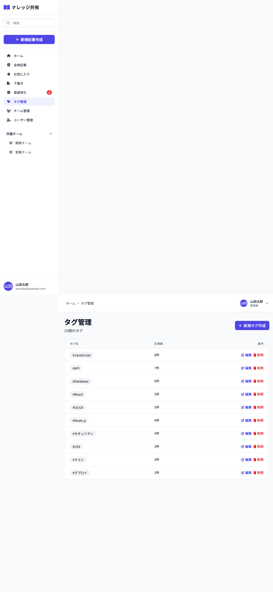

# 10_タグ管理画面

## 1. 画面概要

タグの作成、編集、削除を行う管理画面です。管理者・リーダーがアクセス可能です。タグごとの記事数も表示されます。

## 2. 表示要件

### 2.1 アクセス条件
- **URL**: `/tags`
- **アクセス権限**: 管理者（admin）・チームリーダー（leader）のみ
- **表示データ**: すべてのタグ一覧

### 2.2 レスポンシブ対応
- **PC**: 1カラムレイアウト、テーブル形式
- **タブレット**: 1カラムレイアウト、テーブル横スクロール可能
- **モバイル**: 1カラムレイアウト、テーブル横スクロール可能

## 3. レイアウト構成

```
┌─────────────────────────────────────────────┐
│ [画面タイトル + 新規タグ作成ボタン]          │
│ タグ管理              [新規タグ作成]         │
│ {件数}個のタグ                              │
├─────────────────────────────────────────────┤
│ [タグ一覧テーブル]                          │
│ ┌───────┬──────┬───────┐                    │
│ │タグ名 │記事数│操作   │                    │
│ ├───────┼──────┼───────┤                    │
│ │#React │ 5件 │編集削除│                    │
│ ├───────┼──────┼───────┤                    │
│ │#JS    │ 8件 │編集削除│                    │
│ └───────┴──────┴───────┘                    │
└─────────────────────────────────────────────┘
```

新規タグ作成モーダル:
```
┌─────────────────────────────────────────────┐
│ [モーダル] 新規タグ作成                      │
├─────────────────────────────────────────────┤
│ タグ名 *                                    │
│ [入力欄]                                    │
│                                             │
│ [キャンセル] [作成]                         │
└─────────────────────────────────────────────┘
```

タグ編集モーダル:
```
┌─────────────────────────────────────────────┐
│ [モーダル] タグを編集                        │
├─────────────────────────────────────────────┤
│ タグ名 *                                    │
│ [入力欄]                                    │
│                                             │
│ [キャンセル] [保存]                         │
└─────────────────────────────────────────────┘
```

## 4. UIコンポーネント一覧

| No. | コンポーネント名 | 種類 | 説明 |
|-----|----------------|------|------|
| 1 | 画面タイトル | Heading | 「タグ管理」と件数 |
| 2 | 新規タグ作成ボタン | Button | モーダルを表示 |
| 3 | タグテーブル | Table | タグ一覧を表示 |
| 4 | タグ名バッジ | Badge | タグ名（#付き） |
| 5 | 記事数 | Text | タグが使用されている記事数 |
| 6 | 編集ボタン | Button | 編集モーダルを表示 |
| 7 | 削除ボタン | Button | 削除確認ダイアログ |
| 8 | 作成モーダル | Modal | 新規タグ作成フォーム |
| 9 | 編集モーダル | Modal | タグ編集フォーム |

## 5. 入力項目とバリデーション

### 5.1 タグ名（作成・編集共通）
- **必須**: はい
- **型**: 文字列（テキスト）
- **プレースホルダー**: 「タグ名を入力」
- **バリデーション**: 空白不可

## 6. アクション一覧

| No. | アクション名 | トリガー | 動作 | 遷移先 |
|-----|------------|---------|------|--------|
| 1 | 新規タグ作成 | 新規タグ作成ボタンクリック | 作成モーダル表示 | 画面内 |
| 2 | タグ作成 | モーダル内「作成」ボタンクリック | バリデーション → 作成処理 | 画面内（状態更新） |
| 3 | タグ編集 | 編集ボタンクリック | 編集モーダル表示（既存値入力済み） | 画面内 |
| 4 | タグ更新 | モーダル内「保存」ボタンクリック | バリデーション → 更新処理 | 画面内（状態更新） |
| 5 | タグ削除 | 削除ボタンクリック | 削除確認ダイアログ → 削除処理 | 画面内（状態更新） |
| 6 | モーダルキャンセル | キャンセルボタンクリック | モーダルを閉じる | 画面内 |

## 7. 画面キャプチャ

### PC版



## 8. 状態管理

### 8.1 状態変数
- `tags`: タグ配列（初期値: mockData.tags）
- `showCreateModal`: 作成モーダルの表示フラグ
- `showEditModal`: 編集モーダルの表示フラグ
- `selectedTag`: 選択されたタグオブジェクト
- `tagName`: タグ名入力値

### 8.2 初期状態
```javascript
{
  tags: [...],
  showCreateModal: false,
  showEditModal: false,
  selectedTag: null,
  tagName: ''
}
```

## 9. 処理フロー

### 9.1 タグ作成フロー
```
1. [新規タグ作成]ボタンクリック
   ↓
2. 作成モーダル表示
   ↓
3. タグ名入力
   ↓
4. [作成]ボタンクリック
   ↓
5. バリデーション
   ├─ NG → アラート表示
   └─ OK → タグ作成処理
       ↓
6. タグ配列に追加
   ↓
7. トースト通知表示
   ↓
8. モーダルを閉じる
```

### 9.2 タグ編集フロー
```
1. [編集]ボタンクリック
   ↓
2. 編集モーダル表示（既存値を入力済み）
   ↓
3. タグ名編集
   ↓
4. [保存]ボタンクリック
   ↓
5. バリデーション
   ├─ NG → アラート表示
   └─ OK → タグ更新処理
       ↓
6. タグ配列を更新
   ↓
7. トースト通知表示
   ↓
8. モーダルを閉じる
```

### 9.3 タグ削除フロー
```
1. [削除]ボタンクリック
   ↓
2. 削除確認ダイアログ表示
   ├─ 記事数 > 0: 「{タグ名}は{件数}件の記事で使用されています。削除してもよろしいですか？」
   └─ 記事数 = 0: 「{タグ名}を削除してもよろしいですか？」
       ↓
3. 確認
   ├─ キャンセル → 処理中断
   └─ OK → 削除処理実行
       ↓
4. タグ配列から削除
   ↓
5. トースト通知表示
```

## 10. デザイン仕様

### 10.1 テーブル
- **背景**: 白（bg-white）
- **ボーダー**: gray-200
- **ヘッダー背景**: gray-50
- **ホバー**: `hover:bg-gray-50`

### 10.2 タグ名バッジ
- **背景**: `bg-gray-100`
- **テキスト**: `text-gray-700`
- **角丸**: `rounded-full`
- **パディング**: `px-3 py-1`
- **フォント**: `text-sm font-medium`

### 10.3 ボタン
- **編集**: `text-indigo-600 hover:text-indigo-900`
- **削除**: `text-red-600 hover:text-red-900`
- **新規作成**: `bg-indigo-600 hover:bg-indigo-700 text-white`

### 10.4 モーダル
- **サイズ**: `sm` (新規・編集共通)
- **背景オーバーレイ**: 半透明グレー
- **入力欄**: `focus:ring-2 focus:ring-indigo-500`

## 11. 制約事項

1. **アクセス権限**:
   - 管理者（admin）とチームリーダー（leader）のみアクセス可能
   - 一般ユーザー（member）はアクセス不可

2. **タグ削除**:
   - 記事で使用されているタグも削除可能
   - 削除前に確認ダイアログで警告を表示

3. **タグ名の重複**:
   - 現在の実装では重複チェックなし（将来的に追加可能）

## 12. エラーハンドリング

| エラー種別 | エラーメッセージ | 表示方法 |
|-----------|----------------|---------|
| タグ名未入力（作成） | 「タグ名を入力してください」 | alert |
| タグ名未入力（編集） | 「タグ名を入力してください」 | alert |
| 作成失敗 | 「タグの作成に失敗しました」 | トースト通知 |
| 更新失敗 | 「タグの更新に失敗しました」 | トースト通知 |
| 削除失敗 | 「タグの削除に失敗しました」 | トースト通知 |

## 13. モーダル仕様

### 13.1 作成モーダル
- **タイトル**: 「新規タグ作成」
- **入力欄**: タグ名（オートフォーカス）
- **ボタン**: キャンセル、作成

### 13.2 編集モーダル
- **タイトル**: 「タグを編集」
- **入力欄**: タグ名（既存値入力済み、オートフォーカス）
- **ボタン**: キャンセル、保存

---

**文書管理情報**
- 作成日: 2024年12月22日
- バージョン: 1.0
- 最終更新日: 2024年12月22日

