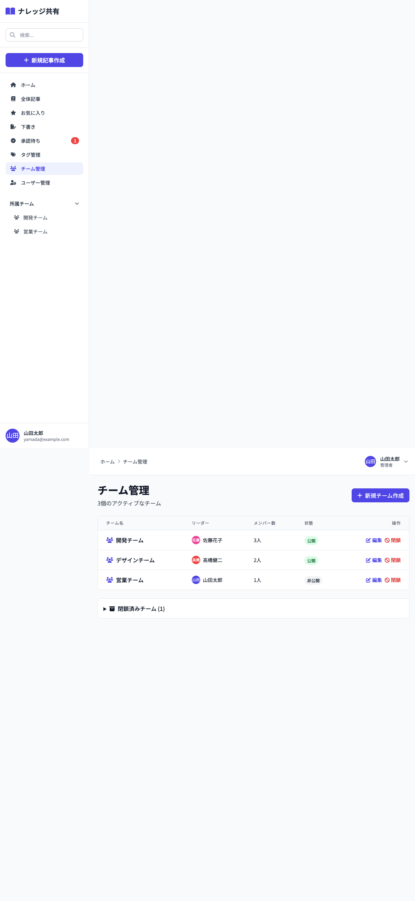

# 11_チーム管理画面

## 1. 画面概要

チームの作成、編集、閉鎖、再開を行う管理画面です。管理者のみがアクセス可能です。アクティブなチームと閉鎖済みチームを分けて表示します。

## 2. 表示要件

### 2.1 アクセス条件
- **URL**: `/teams`
- **アクセス権限**: 管理者（admin）のみ
- **表示データ**: すべてのチーム一覧

### 2.2 レスポンシブ対応
- **PC**: 1カラムレイアウト、テーブル形式
- **タブレット**: 1カラムレイアウト、テーブル横スクロール可能
- **モバイル**: 1カラムレイアウト、テーブル横スクロール可能

## 3. レイアウト構成

```
┌─────────────────────────────────────────────┐
│ [画面タイトル + 新規チーム作成ボタン]        │
│ チーム管理            [新規チーム作成]        │
│ {件数}個のアクティブなチーム                 │
├─────────────────────────────────────────────┤
│ [アクティブチームテーブル]                   │
│ ┌────────┬──────┬──────┬────┬───────┐      │
│ │チーム名│リーダ│メンバ│状態│操作  │      │
│ ├────────┼──────┼──────┼────┼───────┤      │
│ │開発    │佐藤  │3人  │公開│編集閉鎖│      │
│ └────────┴──────┴──────┴────┴───────┘      │
├─────────────────────────────────────────────┤
│ [閉鎖済みチーム] (折りたたみ可能)            │
│ ▼ 閉鎖済みチーム (1)                        │
│   ┌──────────────────────────────────────┐ │
│   │ 旧プロジェクトチーム (佐藤花子) [再開] │ │
│   └──────────────────────────────────────┘ │
└─────────────────────────────────────────────┘
```

新規チーム作成/編集モーダル:
```
┌─────────────────────────────────────────────┐
│ [モーダル] 新規チーム作成 / チームを編集     │
├─────────────────────────────────────────────┤
│ チーム名 *                                 │
│ [入力欄]                                   │
│                                            │
│ チームリーダー *                           │
│ [セレクト]                                 │
│                                            │
│ メンバー                                   │
│ ┌──────────────────────────────────────┐  │
│ │ ☑ ユーザー1                         │  │
│ │ ☐ ユーザー2                         │  │
│ │ ...                                  │  │
│ └──────────────────────────────────────┘  │
│                                            │
│ ☑ 公開チーム                               │
│                                             │
│ [キャンセル] [作成/保存]                    │
└─────────────────────────────────────────────┘
```

## 4. UIコンポーネント一覧

| No. | コンポーネント名 | 種類 | 説明 |
|-----|----------------|------|------|
| 1 | 画面タイトル | Heading | 「チーム管理」と件数 |
| 2 | 新規チーム作成ボタン | Button | モーダルを表示 |
| 3 | アクティブチームテーブル | Table | アクティブなチーム一覧 |
| 4 | チーム名 | Text | アイコン付き表示 |
| 5 | リーダー情報 | User Info | アバター、名前 |
| 6 | メンバー数 | Text | 「{人数}人」 |
| 7 | 状態バッジ | Badge | 公開/非公開 |
| 8 | 編集ボタン | Button | 編集モーダルを表示 |
| 9 | 閉鎖ボタン | Button | チームを閉鎖 |
| 10 | 閉鎖済みチームセクション | Details | 折りたたみ可能 |
| 11 | 再開ボタン | Button | チームを再開 |
| 12 | 作成/編集モーダル | Modal | チーム作成・編集フォーム |

## 5. 入力項目とバリデーション

### 5.1 チーム名
- **必須**: はい
- **型**: 文字列（テキスト）
- **プレースホルダー**: 「チーム名を入力」
- **バリデーション**: 空白不可

### 5.2 チームリーダー
- **必須**: はい
- **型**: セレクト
- **初期値**: 「選択してください」
- **選択肢**: すべてのユーザー
- **バリデーション**: 選択必須

### 5.3 メンバー
- **必須**: いいえ
- **型**: チェックボックス（複数選択）
- **選択肢**: リーダー以外のすべてのユーザー
- **注意**: リーダーは自動的にメンバーに含まれる

### 5.4 公開チーム
- **必須**: いいえ
- **型**: チェックボックス
- **初期値**: true（チェック済み）
- **説明**: 公開チームは全員が閲覧可能

## 6. アクション一覧

| No. | アクション名 | トリガー | 動作 | 遷移先 |
|-----|------------|---------|------|--------|
| 1 | 新規チーム作成 | 新規チーム作成ボタンクリック | 作成モーダル表示 | 画面内 |
| 2 | チーム作成 | モーダル内「作成」ボタンクリック | バリデーション → 作成処理 | 画面内（状態更新） |
| 3 | チーム編集 | 編集ボタンクリック | 編集モーダル表示（既存値入力済み） | 画面内 |
| 4 | チーム更新 | モーダル内「保存」ボタンクリック | バリデーション → 更新処理 | 画面内（状態更新） |
| 5 | チーム閉鎖 | 閉鎖ボタンクリック | 確認ダイアログ → 閉鎖処理 | 画面内（状態更新） |
| 6 | チーム再開 | 再開ボタンクリック | 確認ダイアログ → 再開処理 | 画面内（状態更新） |
| 7 | メンバー選択トグル | チェックボックスクリック | メンバー選択/解除 | 画面内 |
| 8 | モーダルキャンセル | キャンセルボタンクリック | モーダルを閉じる | 画面内 |
| 9 | 閉鎖済みチーム展開 | Detailsクリック | 閉鎖済みチーム一覧を表示 | 画面内 |

## 7. 画面キャプチャ

### PC版



## 8. 状態管理

### 8.1 状態変数
- `teams`: チーム配列（初期値: mockData.teams）
- `showModal`: モーダルの表示フラグ
- `editingTeam`: 編集中のチームオブジェクト（nullの場合は新規作成）
- `formData`: フォームデータ
  - `name`: チーム名
  - `leaderId`: リーダーID
  - `memberIds`: メンバーID配列
  - `public`: 公開フラグ

### 8.2 初期状態
```javascript
{
  teams: [...],
  showModal: false,
  editingTeam: null,
  formData: {
    name: '',
    leaderId: '',
    memberIds: [],
    public: true
  }
}
```

## 9. 処理フロー

### 9.1 チーム作成フロー
```
1. [新規チーム作成]ボタンクリック
   ↓
2. 作成モーダル表示（フォームリセット）
   ↓
3. フォーム入力
   ├─ チーム名
   ├─ リーダー選択
   ├─ メンバー選択（複数可）
   └─ 公開チームチェック
   ↓
4. [作成]ボタンクリック
   ↓
5. バリデーション
   ├─ NG → アラート表示
   └─ OK → チーム作成処理
       ↓
6. リーダーをメンバーに自動追加
   ↓
7. チーム配列に追加（status='active'）
   ↓
8. トースト通知表示
   ↓
9. モーダルを閉じる
```

### 9.2 チーム編集フロー
```
1. [編集]ボタンクリック
   ↓
2. 編集モーダル表示（既存値を入力済み）
   ├─ チーム名: 既存値
   ├─ リーダー: 既存値
   ├─ メンバー: リーダー以外の既存メンバー
   └─ 公開: 既存値
   ↓
3. フォーム編集
   ↓
4. [保存]ボタンクリック
   ↓
5. バリデーション
   ├─ NG → アラート表示
   └─ OK → チーム更新処理
       ↓
6. リーダーをメンバーに自動追加
   ↓
7. チーム配列を更新
   ↓
8. トースト通知表示
   ↓
9. モーダルを閉じる
```

### 9.3 チーム閉鎖フロー
```
1. [閉鎖]ボタンクリック
   ↓
2. 確認ダイアログ表示
   「チームを閉鎖してもよろしいですか？」
   ↓
3. 確認
   ├─ キャンセル → 処理中断
   └─ OK → 閉鎖処理実行
       ↓
4. チームのstatusを'closed'に更新
   ↓
5. トースト通知表示
   ↓
6. アクティブチーム一覧から削除、閉鎖済みセクションに移動
```

### 9.4 チーム再開フロー
```
1. [再開]ボタンクリック
   ↓
2. 確認ダイアログ表示
   「チームを再開してもよろしいですか？」
   ↓
3. 確認
   ├─ キャンセル → 処理中断
   └─ OK → 再開処理実行
       ↓
4. チームのstatusを'active'に更新
   ↓
5. トースト通知表示
   ↓
6. 閉鎖済みセクションから削除、アクティブチーム一覧に移動
```

## 10. デザイン仕様

### 10.1 テーブル
- **背景**: 白（bg-white）
- **ボーダー**: gray-200
- **ヘッダー背景**: gray-50
- **ホバー**: `hover:bg-gray-50`

### 10.2 バッジ
- **公開**: `bg-green-100 text-green-800`
- **非公開**: `bg-gray-100 text-gray-800`

### 10.3 ボタン
- **編集**: `text-indigo-600 hover:text-indigo-900`
- **閉鎖**: `text-red-600 hover:text-red-900`
- **再開**: `text-indigo-600 hover:text-indigo-900`
- **新規作成**: `bg-indigo-600 hover:bg-indigo-700 text-white`

### 10.4 閉鎖済みチームセクション
- **背景**: 白（bg-white）
- **ボーダー**: gray-200
- **折りたたみ**: `<details>` タグを使用
- **アイコン**: `fa-archive`

### 10.5 モーダル
- **サイズ**: `md` (最大幅)
- **メンバー選択エリア**: 
  - 最大高さ: `max-h-48`
  - スクロール: `overflow-y-auto`
  - ホバー: `hover:bg-gray-50`

## 11. 制約事項

1. **アクセス権限**:
   - 管理者（admin）のみアクセス可能
   - チームリーダー（leader）と一般ユーザー（member）はアクセス不可

2. **リーダーとメンバー**:
   - リーダーは自動的にメンバーに含まれる
   - メンバー選択時にリーダーは表示されない

3. **チーム閉鎖**:
   - 閉鎖されたチームは通常の操作ができなくなる
   - 閉鎖済みチームは折りたたみセクションに表示
   - 再開することで再びアクティブになる

4. **公開チーム**:
   - 公開チームは全員が閲覧可能
   - 非公開チームはメンバーのみ閲覧可能

## 12. エラーハンドリング

| エラー種別 | エラーメッセージ | 表示方法 |
|-----------|----------------|---------|
| チーム名未入力 | 「チーム名を入力してください」 | alert |
| リーダー未選択 | 「チームリーダーを選択してください」 | alert |
| 作成失敗 | 「チームの作成に失敗しました」 | トースト通知 |
| 更新失敗 | 「チームの更新に失敗しました」 | トースト通知 |
| 閉鎖失敗 | 「チームの閉鎖に失敗しました」 | トースト通知 |
| 再開失敗 | 「チームの再開に失敗しました」 | トースト通知 |

---

**文書管理情報**
- 作成日: 2024年12月22日
- バージョン: 1.0
- 最終更新日: 2024年12月22日

