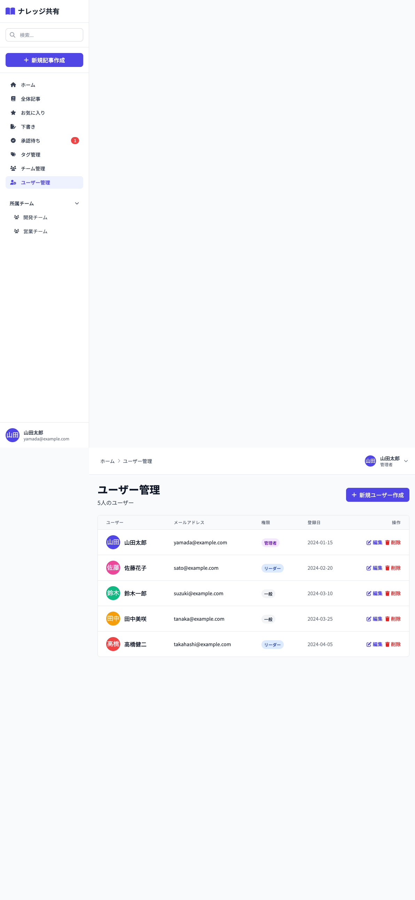

# 12_ユーザー管理画面

## 1. 画面概要

ユーザーの作成、編集、削除を行う管理画面です。管理者のみがアクセス可能です。ユーザーの権限（管理者・リーダー・一般）も管理できます。

## 2. 表示要件

### 2.1 アクセス条件
- **URL**: `/users`
- **アクセス権限**: 管理者（admin）のみ
- **表示データ**: すべてのユーザー一覧

### 2.2 レスポンシブ対応
- **PC**: 1カラムレイアウト、テーブル形式
- **タブレット**: 1カラムレイアウト、テーブル横スクロール可能
- **モバイル**: 1カラムレイアウト、テーブル横スクロール可能

## 3. レイアウト構成

```
┌─────────────────────────────────────────────┐
│ [画面タイトル + 新規ユーザー作成ボタン]      │
│ ユーザー管理          [新規ユーザー作成]     │
│ {件数}人のユーザー                          │
├─────────────────────────────────────────────┤
│ [ユーザー一覧テーブル]                      │
│ ┌───────┬──────────┬────┬────────┬───────┐ │
│ │ユーザー│メール    │権限│登録日  │操作   │ │
│ ├───────┼──────────┼────┼────────┼───────┤ │
│ │[画像] │email@... │管理者│2024/01│編集削除│ │
│ │ 名前  │          │    │        │       │ │
│ └───────┴──────────┴────┴────────┴───────┘ │
└─────────────────────────────────────────────┘
```

新規ユーザー作成モーダル:
```
┌─────────────────────────────────────────────┐
│ [モーダル] 新規ユーザー作成                  │
├─────────────────────────────────────────────┤
│ ユーザー名 *                                │
│ [入力欄]                                    │
│                                            │
│ メールアドレス *                            │
│ [入力欄]                                    │
│                                            │
│ パスワード *                                │
│ [入力欄]                                    │
│                                            │
│ 権限 *                                      │
│ [セレクト]                                  │
│                                            │
│ [キャンセル] [作成]                        │
└─────────────────────────────────────────────┘
```

ユーザー編集モーダル:
```
┌─────────────────────────────────────────────┐
│ [モーダル] ユーザーを編集                    │
├─────────────────────────────────────────────┤
│ ユーザー名 *                                │
│ [入力欄]                                    │
│                                            │
│ メールアドレス *                            │
│ [入力欄]                                    │
│                                            │
│ 権限 *                                      │
│ [セレクト]                                  │
│ (パスワード入力欄は表示されない)            │
│                                            │
│ [キャンセル] [保存]                         │
└─────────────────────────────────────────────┘
```

## 4. UIコンポーネント一覧

| No. | コンポーネント名 | 種類 | 説明 |
|-----|----------------|------|------|
| 1 | 画面タイトル | Heading | 「ユーザー管理」と件数 |
| 2 | 新規ユーザー作成ボタン | Button | モーダルを表示 |
| 3 | ユーザーテーブル | Table | ユーザー一覧を表示 |
| 4 | ユーザー情報 | User Info | アバター画像、名前 |
| 5 | メールアドレス | Text | メールアドレス表示 |
| 6 | 権限バッジ | Badge | 管理者/リーダー/一般 |
| 7 | 登録日 | Date | 登録日時 |
| 8 | 編集ボタン | Button | 編集モーダルを表示 |
| 9 | 削除ボタン | Button | ユーザー削除 |
| 10 | 作成モーダル | Modal | 新規ユーザー作成フォーム |
| 11 | 編集モーダル | Modal | ユーザー編集フォーム |

## 5. 入力項目とバリデーション

### 5.1 ユーザー名（作成・編集共通）
- **必須**: はい
- **型**: 文字列（テキスト）
- **プレースホルダー**: 「ユーザー名を入力」
- **バリデーション**: 空白不可

### 5.2 メールアドレス（作成・編集共通）
- **必須**: はい
- **型**: メールアドレス
- **プレースホルダー**: 「email@example.com」
- **バリデーション**: 
  - 空白不可
  - メールアドレス形式（将来的に実装）

### 5.3 パスワード（作成時のみ）
- **必須**: はい（作成時のみ）
- **型**: パスワード（非表示）
- **プレースホルダー**: 「パスワードを入力」
- **バリデーション**: 空白不可
- **注意**: 編集時はパスワード欄を表示しない

### 5.4 権限（作成・編集共通）
- **必須**: はい
- **型**: セレクト
- **選択肢**: 
  - 一般（member）
  - チームリーダー（leader）
  - 管理者（admin）
- **初期値**: 一般（member）
- **バリデーション**: 選択必須

## 6. アクション一覧

| No. | アクション名 | トリガー | 動作 | 遷移先 |
|-----|------------|---------|------|--------|
| 1 | 新規ユーザー作成 | 新規ユーザー作成ボタンクリック | 作成モーダル表示 | 画面内 |
| 2 | ユーザー作成 | モーダル内「作成」ボタンクリック | バリデーション → 作成処理 | 画面内（状態更新） |
| 3 | ユーザー編集 | 編集ボタンクリック | 編集モーダル表示（既存値入力済み） | 画面内 |
| 4 | ユーザー更新 | モーダル内「保存」ボタンクリック | バリデーション → 更新処理 | 画面内（状態更新） |
| 5 | ユーザー削除 | 削除ボタンクリック | 確認ダイアログ → 削除処理 | 画面内（状態更新） |
| 6 | モーダルキャンセル | キャンセルボタンクリック | モーダルを閉じる | 画面内 |

## 7. 画面キャプチャ

### PC版



## 8. 状態管理

### 8.1 状態変数
- `users`: ユーザー配列（初期値: mockData.users）
- `showModal`: モーダルの表示フラグ
- `editingUser`: 編集中のユーザーオブジェクト（nullの場合は新規作成）
- `formData`: フォームデータ
  - `name`: ユーザー名
  - `email`: メールアドレス
  - `password`: パスワード（作成時のみ）
  - `role`: 権限（'member' / 'leader' / 'admin'）

### 8.2 初期状態
```javascript
{
  users: [...],
  showModal: false,
  editingUser: null,
  formData: {
    name: '',
    email: '',
    password: '',
    role: 'member'
  }
}
```

## 9. 処理フロー

### 9.1 ユーザー作成フロー
```
1. [新規ユーザー作成]ボタンクリック
   ↓
2. 作成モーダル表示（フォームリセット）
   ↓
3. フォーム入力
   ├─ ユーザー名
   ├─ メールアドレス
   ├─ パスワード
   └─ 権限選択
   ↓
4. [作成]ボタンクリック
   ↓
5. バリデーション
   ├─ NG → アラート表示
   └─ OK → ユーザー作成処理
       ↓
6. アバター画像を自動生成（UI Avatars API）
   ↓
7. ユーザー配列に追加
   ↓
8. トースト通知表示
   ↓
9. モーダルを閉じる
```

### 9.2 ユーザー編集フロー
```
1. [編集]ボタンクリック
   ↓
2. 編集モーダル表示（既存値を入力済み）
   ├─ ユーザー名: 既存値
   ├─ メールアドレス: 既存値
   ├─ パスワード: 表示しない
   └─ 権限: 既存値
   ↓
3. フォーム編集
   ↓
4. [保存]ボタンクリック
   ↓
5. バリデーション
   ├─ NG → アラート表示
   └─ OK → ユーザー更新処理
       ↓
6. ユーザー配列を更新
   ↓
7. トースト通知表示
   ↓
8. モーダルを閉じる
```

### 9.3 ユーザー削除フロー
```
1. [削除]ボタンクリック
   ↓
2. 確認ダイアログ表示
   「このユーザーを削除してもよろしいですか？」
   ↓
3. 確認
   ├─ キャンセル → 処理中断
   └─ OK → 削除処理実行
       ↓
4. ユーザー配列から削除
   ↓
5. トースト通知表示
```

## 10. 権限バッジ

### 10.1 バッジ色
- **管理者**: `bg-purple-100 text-purple-800`
- **チームリーダー**: `bg-blue-100 text-blue-800`
- **一般**: `bg-gray-100 text-gray-800`

### 10.2 表示テキスト
- **管理者**: 「管理者」
- **チームリーダー**: 「リーダー」
- **一般**: 「一般」

## 11. デザイン仕様

### 11.1 テーブル
- **背景**: 白（bg-white）
- **ボーダー**: gray-200
- **ヘッダー背景**: gray-50
- **ホバー**: `hover:bg-gray-50`

### 11.2 ユーザー情報
- **アバター**: `w-10 h-10 rounded-full`
- **名前**: `font-medium text-gray-900`

### 11.3 権限バッジ
- **サイズ**: `px-2 py-1 rounded-full text-xs font-medium`

### 11.4 ボタン
- **編集**: `text-indigo-600 hover:text-indigo-900`
- **削除**: `text-red-600 hover:text-red-900`
- **新規作成**: `bg-indigo-600 hover:bg-indigo-700 text-white`

### 11.5 モーダル
- **サイズ**: `md` (最大幅)
- **背景オーバーレイ**: 半透明グレー
- **入力欄**: `focus:ring-2 focus:ring-indigo-500`

## 12. 制約事項

1. **アクセス権限**:
   - 管理者（admin）のみアクセス可能
   - チームリーダー（leader）と一般ユーザー（member）はアクセス不可

2. **パスワード**:
   - 新規作成時のみパスワード入力が必要
   - 編集時はパスワード欄を表示しない（パスワード変更機能は将来的に追加可能）

3. **アバター画像**:
   - UI Avatars APIを使用して自動生成
   - URL形式: `https://ui-avatars.com/api/?name={name}&background=random&color=fff`

4. **ユーザー削除**:
   - 削除前に確認ダイアログを表示
   - 削除後、該当ユーザーの記事やコメントへの影響は考慮が必要（将来的な実装）

## 13. エラーハンドリング

| エラー種別 | エラーメッセージ | 表示方法 |
|-----------|----------------|---------|
| ユーザー名未入力 | 「ユーザー名を入力してください」 | alert |
| メールアドレス未入力 | 「メールアドレスを入力してください」 | alert |
| パスワード未入力（作成時） | 「パスワードを入力してください」 | alert |
| 作成失敗 | 「ユーザーの作成に失敗しました」 | トースト通知 |
| 更新失敗 | 「ユーザー情報の更新に失敗しました」 | トースト通知 |
| 削除失敗 | 「ユーザーの削除に失敗しました」 | トースト通知 |

## 14. 確認ダイアログ

### 14.1 削除確認
- **メッセージ**: 「このユーザーを削除してもよろしいですか？」
- **ボタン**: OK / キャンセル

---

**文書管理情報**
- 作成日: 2024年12月22日
- バージョン: 1.0
- 最終更新日: 2024年12月22日

