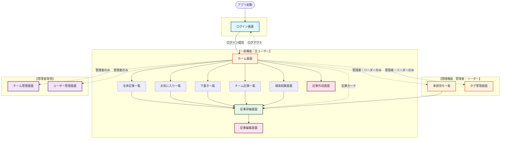
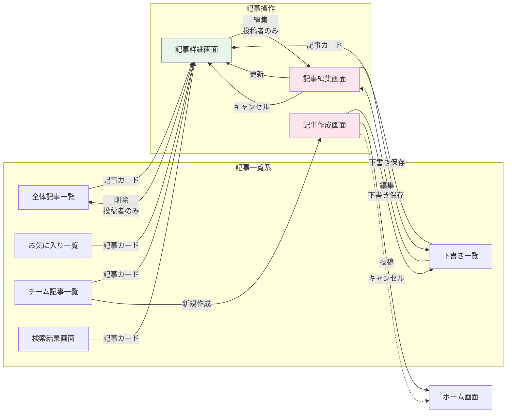
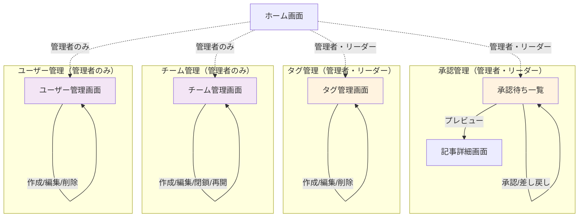

# 画面遷移図

## 概要

ナレッジ共有アプリケーションの画面遷移図です。ユーザーの権限（管理者、リーダー、一般）による画面表示の分岐も明示しています。

## 画面遷移図（Mermaid形式）

### 全体図（階層構造）



### 詳細遷移図

#### 1. 記事関連の遷移詳細



#### 2. 管理機能の遷移詳細



## 画面一覧

| No. | 画面名 | URL/ルート | アクセス権限 |
|-----|--------|-----------|------------|
| 1 | ログイン画面 | `/` | 全員 |
| 2 | ホーム画面 | `/home` | 認証済み |
| 3 | 全体記事一覧 | `/articles` | 認証済み |
| 4 | チーム記事一覧 | `/teams/:teamId/articles` | チームメンバー |
| 5 | 記事詳細画面 | `/articles/:id` | 認証済み |
| 6 | 記事作成画面 | `/articles/new` | 認証済み |
| 7 | 記事編集画面 | `/articles/:id/edit` | 記事作成者のみ |
| 8 | 下書き一覧 | `/drafts` | 認証済み |
| 9 | 承認待ち一覧 | `/approval` | 管理者・リーダーのみ |
| 10 | 検索結果画面 | `/search?q=:query` | 認証済み |
| 11 | お気に入り一覧 | `/favorites` | 認証済み |
| 12 | タグ管理画面 | `/tags` | 管理者・リーダーのみ |
| 13 | チーム管理画面 | `/teams` | 管理者のみ |
| 14 | ユーザー管理画面 | `/users` | 管理者のみ |

## 遷移パターン詳細

### 1. 認証フロー

```
[ログイン画面]
    ↓ (ログイン成功)
[ホーム画面]
```

- **条件**: 任意のユーザーID/パスワードでログイン可能（デモ版）

### 2. 記事閲覧フロー

```
[ホーム画面 / 記事一覧]
    ↓ (記事カードクリック)
[記事詳細画面]
    ↓ (編集ボタン - 投稿者のみ)
[記事編集画面]
    ↓ (保存)
[記事詳細画面]
```

### 3. 記事作成フロー

```
[ホーム画面 / チーム記事一覧]
    ↓ (新規記事作成)
[記事作成画面]
    ↓ (下書き保存)
[下書き一覧]
    ↓ (編集)
[記事編集画面]
    ↓ (投稿/承認申請)
[ホーム画面]
```

### 4. 承認フロー（管理者・リーダーのみ）

```
[承認待ち一覧]
    ↓ (承認ボタン)
[承認待ち一覧] (更新)
    ↓ (差し戻しボタン)
[差し戻しモーダル]
    ↓ (理由入力 → 送信)
[承認待ち一覧] (更新)
    ↓ (ユーザーの下書き一覧に移動)
[下書き一覧]
```

### 5. 検索フロー

```
[サイドバー検索バー]
    ↓ (キーワード入力 + Enter)
[検索結果画面]
    ↓ (記事カードクリック)
[記事詳細画面]
```

### 6. お気に入りフロー

```
[記事詳細 / 記事一覧]
    ↓ (お気に入りボタン)
[記事詳細 / 記事一覧] (状態更新)
    ↓ (サイドバー: お気に入り)
[お気に入り一覧]
```

### 7. 管理画面フロー（管理者・リーダー）

#### タグ管理（管理者・リーダー）
```
[タグ管理画面]
    ↓ (新規タグ作成)
[タグ作成モーダル]
    ↓ (保存)
[タグ管理画面] (更新)
```

#### チーム管理（管理者のみ）
```
[チーム管理画面]
    ↓ (新規チーム作成)
[チーム作成モーダル]
    ↓ (保存)
[チーム管理画面] (更新)
```

#### ユーザー管理（管理者のみ）
```
[ユーザー管理画面]
    ↓ (新規ユーザー作成)
[ユーザー作成モーダル]
    ↓ (保存)
[ユーザー管理画面] (更新)
```

## 権限による画面表示の制御

### 管理者（admin）

- **アクセス可能な全画面**: 全14画面
- **専用機能**: 
  - ユーザー管理
  - チーム管理
  - タグ管理
  - 記事承認

### チームリーダー（leader）

- **アクセス可能な画面**: 13画面（ユーザー管理を除く）
- **専用機能**:
  - タグ管理
  - 記事承認
  - チーム記事の作成・編集・削除

### 一般ユーザー（member）

- **アクセス可能な画面**: 10画面
- **アクセス不可**:
  - 承認待ち一覧
  - タグ管理
  - チーム管理
  - ユーザー管理
- **制限事項**:
  - 自分の記事のみ編集・削除可能
  - 自分のコメントのみ削除可能

## モーダルダイアログ遷移

以下の画面では、モーダルダイアログが表示されますが、画面遷移は発生しません：

1. **タグ管理画面**
   - タグ作成モーダル
   - タグ編集モーダル
   - タグ削除確認モーダル

2. **チーム管理画面**
   - チーム作成モーダル
   - チーム編集モーダル
   - チーム閉鎖確認モーダル

3. **ユーザー管理画面**
   - ユーザー作成モーダル
   - ユーザー編集モーダル
   - ユーザー削除確認モーダル

4. **承認待ち一覧**
   - 差し戻し理由入力モーダル

5. **記事詳細画面**
   - 削除確認モーダル（将来的に追加可能）

## ブラウザ操作による遷移

- **ブラウザの戻る/進むボタン**: 履歴に基づいて前後の画面に遷移
- **パンくずリスト**: パンくずリストをクリックして該当画面に遷移

## エラーハンドリング

1. **未認証ユーザー**: 自動的にログイン画面にリダイレクト
2. **権限不足**: エラーメッセージ表示、ホーム画面へリダイレクト
3. **存在しないリソース**: 404エラー表示、ホーム画面へリダイレクト
4. **ネットワークエラー**: トースト通知でエラー表示

---

**文書管理情報**
- 作成日: 2024年12月22日
- バージョン: 1.0
- 最終更新日: 2024年12月22日

